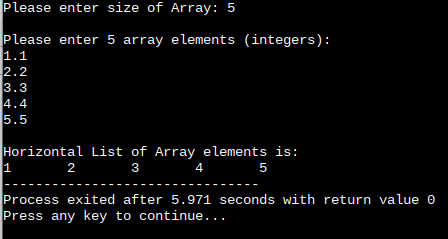
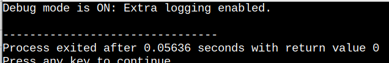
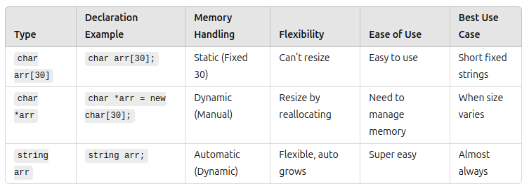
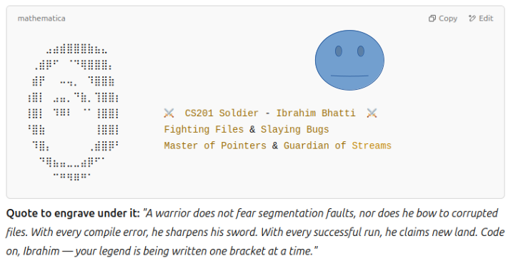

# Questions/Solutions

# !! Hello World! Program and Operators

## Problem Statement #01

>

```C++
//Solution
#include <iostream>

main()
{
	  std::cout << "Hello, World!\n";
	  
	  int x;
	  float y;
	  char z;
	  
	  std::cout << "Please enter an integer: ";
	  std::cin >> x;

	  std::cout << "Please enter a float: ";
	  std::cin >> y;

	  std::cout << "Please enter an character: ";
	  std::cin >> z;
	  
	  std::cout << "You entered the integer: " << x << std::endl;

	  std::cout << "You entered the float: " << y << std::endl;

	  std::cout << "You entered the character: " << z << std::endl;
	
	  return 0;
}
```

>

## Problem Statement #02

### Area and Perimeter Calculation of Geometrical Shapes:


```C++
//Solution
#include <iostream>
#include <cmath>

main()
{
	  const double Pi = M_PI;
	
	  std::cout << "Circle Calculations\n";
	  
	  float r,circum, areaOfCircle;
	  
	  std::cout << "Please enter the radius of circle: ";
	  std::cin >> r;
	  
	  circum = 2 * Pi * r;
	  std::cout << "Circumference of the circle: " << circum << "\n";
	  
	  areaOfCircle = Pi * r * r;
	  std::cout << "Area of the circle: " << areaOfCircle << "\n";
	  
	  
	  std::cout << "\nRectange Calculations\n";
	  
	  float l, w, perimeter, areaOfRectangle;
	  
	  std::cout << "Please enter length of the rectangle: ";
	  std::cin >> l;
	  
	  std::cout << "Please enter width of the rectangle: ";
	  std::cin >> w;
	  
	  perimeter = 2 * (l + w);
	  std::cout << "Perimeter of the rectangle: " << perimeter << "\n";
	  
	  areaOfRectangle = l * w;
	  std::cout << "Area of the rectangle: " << areaOfRectangle << "\n";

	  return 0;
}
```


## Problem Statement #03

### Temperature Conversion Program:


```C++
//Solution
#include <iostream>
using namespace std;

main()
{
	  char unit;
	
	  cout << "Enter the unit of temperature (use 'F', 'C', or 'K'): ";
	  cin >> unit;
	  
	  double temperature, celcius, kelvin, fahrenheit;
	  
	  cout << "Please enter temperature: ";
  	  cin >> temperature;

   	  if(unit == 'F'){
        //in every block value of temurature varies.
        //Here temperature = temperature in fahrenheit.
		 cout << "Temperature in Fahrenheit: " << temperature << "°F\n";

		 celcius = (temperature - 32) * 5 / 9;
		 cout << "Temperature in Celcius: " << celcius << "°C\n";
		 
		 kelvin = celcius + 273.25;
		 cout << "Temperature in Kelvin: " << kelvin << "°K\n";
	  }else if(unit == 'C'){
        //Here temperature = temperature in celcius.
		 cout << "Temperature in Celcius: " << temperature << "°C\n";
		 
		 fahrenheit = (temperature * 9 / 5) + 32;
		 cout << "Temperature in Fahrenheit: " << fahrenheit << "°F\n";
		 
		 kelvin = temperature + 273.25;
		 cout << "Temperature in Kelvin: " << kelvin << "°K\n";
	  }else if(unit == 'K'){
        //Here temperature = temperature in kelvin.
 		cout << "Temperature in Kelvin: " << temperature << "°K\n";
 		
 		fahrenheit = (temperature - 273.15) * 9 / 5 + 32;
 		cout << "Temperature in Fahrenheit: " << fahrenheit << "°F\n";
 		
 		celcius = temperature - 273.15;
 		cout << "Temperature in Celcius: " << celcius << "°C\n";
	  }else{
	  	cout << "Invalid unit entered!";
	  };

	  return 0;
}
```


## Problem Statement #04

### Simple and Compound Interest Calculator


```C++
//Solution
#include <iostream>
#include <cmath> //For using pow() in calculating compound interest
using namespace std;

int main()
{

	  cout << "Simple and Compound interest calculator\n";
	  cout << "\nLoud Disclaimer:\n Interest is Haram. If you're looking for a shortcut to trouble, well, here you go.\n" << endl ;

	  int principal = 0, time = 0, n = 0;
	  float rate = 0;

	  // Input values from user
	  cout << "Enter the principal amount: ";
	  cin >> principal;
	  
	  cout << "Enter the annual interest rate (as a percentage): ";
	  cin >> rate;
	  
	  cout << "Enter the time (in years): ";
	  cin >> time;
	  
	  cout << "Enter the number of times interest is compounded per year: ";
	  cin >> n;
	  
	  // Calculating Interest
	  double simpleInterest;
	  simpleInterest = (principal * rate  * time) / 100;
	  
	  double compoundInterest;
	  compoundInterest = principal * pow((1 + rate / (n * 100)) , (n * time)) - principal;
	  
	  cout << "Simple Interest: " << simpleInterest << endl;
	  
	  cout << "Compound Interest: " << compoundInterest << endl;

	  return 0;
}
```

>

## Problem Statement #05

### Parallel and series resistances calculator

>

```C++
//Solution
#include <iostream>
#include <iomanip>
using namespace std;

int main()
{
	cout << "\nDisclaimer:\nThis program can calculate upto 5 resistances.\nSo, Do not try to overachieve, or look Smart.\n" << endl;
	
	int n;
	cout<< "Enter the number of resistors (1-5): ";
	cin >> n;
	
	double r1, r2, r3, r4, r5, rSeries = 0, rParallel = 0;
	
	if(n >= 0){
		cout<< "Enter the resistance values (in ohms):\n";
	}
	
	if(n >= 1){
		cout<< "Resistor 1: ";
		cin >> r1;
		
		rSeries += r1;
		rParallel += 1 / r1;
	}
	
	if(n >= 2){
		cout<< "Resistor 2: ";
		cin >> r2;
		
		rSeries += r2;
		rParallel += 1 / r2;
	}
	
	if(n >= 3){
		cout<< "Resistor 3: ";
		cin >> r3;
		
		rSeries += r3;
		rParallel += 1 / r3;
	}
	
	if(n >= 4){
		cout<< "Resistor 4: ";
		cin >> r4;
		bs ghr hi hota hu 
		rSeries += r4;
		rParallel += 1 / r4;
	}
	
	if(n >= 5){
		cout<< "Resistor 5: ";
		cin >> r5;
		
		rSeries += r5;
		rParallel += 1 / r5;
	}
	
	cout << "Equivalent Series Resistance: " << rSeries << " ohms" << endl;

	cout << fixed << setprecision(2);
	cout << "Equivalent Parallel Resistance: " << 1 / rParallel << " ohms" << endl;

	return 0;
}
```

>

---

# !! If-else / Switch Statements

## Problem Statement #01

### Voting eligibility checker

```C++
//Solution
#include <iostream>
using namespace std;

int main()
{

	cout << "\nDisclaimer:\nThis program can be sarcastic.\n" << endl;

	int age;
	
	cout << "Please enter your age: ";
	cin >> age;
	
	if(age >= 18){
		cout << "You can vote now! Use that power wisely... or ahmmmm." << endl ;
	}else{
		cout << "You're not eligible, You still need to grow more, Baby!" << endl;
	}

	return 0;
}
```

## Problem Statement #02

### Parking Fee Calculator

```C++
//Solution
#include <iostream>
using namespace std;

int main()
{

	cout << "\nParking Fee Calculator\n" << endl;

	int hour;
	cout << "Please enter how many hours you used the parking: ";
	cin >> hour;
	
	int charges = 0;
	
	// to check if the user parked more than 1 hour
	if(hour > 1){
		charges = (hour - 1) * 200; // For each hour after the first, charges Rs 200/hr
		cout << "You've to pay " << charges << " for " << hour << "hr. Thank You!";
	}else if(hour == 1){
		cout << "You do not have to pay for the first hour. Thank You!" << endl;
	}else{
		cout << "Invalid input. Parking duration can't be less than 1 hour.";
	}
	
	return 0;
}
```

>

## Problem Statement #03

### BMI Calculator

```C++
//SOlution
#include <iostream>
#include <iomanip> //For decimal precision
using namespace std;

int main()
{

	cout << "\nBMI Calculator App\n" << endl;

	double w = 0, h = 0;

	cout << "Please enter your weight in kg's: ";
	cin >> w;

	cout << "Please enter your height in meters: ";
	cin >> h;

	double BMI = 0;

	BMI = w / (h * h);

	cout << fixed << setprecision(2);

	if(BMI < 18.5){
		cout << "\nYou're Underweight, BABY! Grow more Plz." << endl;
		cout << "Your actual BMI is " << BMI;
	}else if(BMI >= 18.5 && BMI < 25){
		cout << "\nYou're Normal-Weighted, You deserve an apple!!" << endl;
		cout << "Your actual BMI is " << BMI;
	}else if(BMI >= 25 && BMI < 30){
		cout << "\nTake care a bit yourself, Over-Weighted DUDE!" << endl;
		cout << "Your actual BMI is " << BMI;
	}else if(BMI >= 30){
		cout << "\nSo sad! Obesity bruh" << endl;
		cout << "Your actual BMI is " << BMI;
	}

	cout << "\n\nBMI chart" << endl;
	cout << "BMI < 18.5 = Underweight" << endl;
	cout << "BMI 18.5 - 25 = Normal Weight" << endl;
	cout << "BMI 25 - 30 = Overweight" << endl;
	cout << "BMI 30+ = Obesity" << endl;

	return 0;
}
```
>

## Problem Statement #04

### Coffee Shop Menu

```C++
//Solution
#include <iostream>
using namespace std;

int main()
{

 	cout << "\nIqbal Coffee Shop Beverages Menu\n" << endl;
 	cout << "1. Espresso" << endl;
 	cout << "2. Latte" << endl;
 	cout << "3. Cappuccino" << endl;
 	cout << "4. Mocha" << endl;
 	
 	int n; //For choice
 	
 	cout << "Please select your preffered coffee beverage(1-4): " ;
 	cin >> n;
 	
 	switch(n){
 		case 1:
 			cout << "Your Espresso will be ready in 5 mins. Thank You!";
 			break;
	 case 2:
 			cout << "Your Latte will be ready in 3 mins. Thank You!";
 			break;
	 case 3:
 			cout << "Your Cappuccino will be ready in 7 mins. Thank You!";
 			break;
	 case 4:
 			cout << "Your Mocha will be ready in 3 mins. Thank You!";
 			break;
	 default:
	 	cout << "Invalid choice. Please select from cuurent menu. Thank You!";

		}

	return 0;
}
```

>

## Problem Statement #05

### Traffic light system

```C++
//Solution
#include <iostream>
using namespace std;

int main()
{

 	cout << "\nTraffic light system, Do not Take it Easy.\n" << endl;

	cout << "1. Red" << endl;
	cout << "2. Yellow" << endl;
	cout << "3. Green" << endl<< endl;
	
	int n; //For choice
	
	cout << "Please select the current signal out there (1-3): ";
	cin >> n;
	
	switch(n){
		case 1:
			cout << "Please STOP! Do not rush, Wait for your Turn";
			break;
		case 2:
			cout << "Buckle up and Proceed with caution! Your turn is ahead.";
			break;
		case 3:
			cout << "Go bruhh";
			break;
		default:
			cout << "Invalid choice, Please choose from (1-3)";
	}

	return 0;
}
```

>

---
---

# !! Loops

## Problem Statement #0.1

### Factorial Calculator

```C++
//Solution
#include <iostream>
using namespace std;

int main()
{
	
	cout << "\nFactorial Calculator\n" << endl;

	int number;
	
	cout << "Please enter the number: ";
	cin >> number;
	
	int factorial = 1;
	
	while(number >= 1){
		factorial = factorial * number;
		number = number - 1;
	}
	
	cout << "The Factorial is: " << factorial;

	return 0;
}
```

>

## Problem Statement #01

### Exponent Calculator for a given number

```C++
//Solution
#include <iostream>
using namespace std;

int main()
{

	cout << "\n'Exponent' Calculator for a given number\n" << endl;

	double x = 0; //Number
	int n ; //Exponent

	cout << "Please enter a number: ";
	cin >> x;

	cout << "Please enter an exponent(1,2,3...n): ";
	cin >> n;

	int counter = 1; // For checking if x is multiplied certain times.
	double result = 1;

	if(n == 0){
		cout << "For " << x << "^0, It becomes = 1" << endl;
	}else{
		while(counter <= n){
			result = result * x;
			counter = counter + 1;
		}
	cout << "\n" << x << "^" << n << " will be calculated as: " << result;
	}

	
	return 0;
}
```

>

## Problem Statement #0.2

### Table calculator

```C++
//Solution
#include <iostream>
using namespace std;

int main()
{

	cout << "\nTable Calculator\n" << endl;
	
	int n;
	
	cout << "Please enter a number: ";
	cin >> n;
	
	int maxMultiplier;
	
	cout << "Please enter maximum multiplier number: ";
	cin >> maxMultiplier;
	
	for(int i = 1; i<=maxMultiplier; i++){
		cout << n << " x " << i << " = " << n * i << endl;
	}
	
	
	return 0;
}
```

>

## Problem Statement #0.3

### 'Hardcoded number' Guessing Game

```C++
//Solution
#include <iostream>
using namespace std;

int main()
{
	//This program will allow users to guess a number from a to z
	//do-while construct is used to allow five tries

	cout << "\nNumber Guessing Game\n" << endl;
	
	char guessChar;
	char answer = 'z';
	int tryNum = 1;
	
	
	//'do' will ask for input, and compares it.
	do{
		cout << "Please enter the character(a to z): ";
		cin >> guessChar;
	
		//check the entered character for equality
		if(guessChar == answer){
			cout << "You guessed it right";
		}else{
			
	  		//this condition will show error message differently for the last try
			if(tryNum == 5){
				cout << "Better luck Next time";
			}else{
				cout << "Please Try again" << endl;
			}
			
		}
		tryNum = tryNum + 1;
		
	//while will loop until user guess isn't correct and user doesn't hit max number of tries
	}while(tryNum <= 5 && guessChar != answer);
	
	return 0;
}
```

>

## Problem Statement #2

### Prime Number Check

```C++
//Solution
#include <iostream>
using namespace std;

int main()
{
	//This program will check if given number is prime or not.

	cout << "\nPrime number check program\n" << endl;
	
	int n = 0;
	
	cout << "Please enter a number: ";
	cin >> n;
	
	
	//Counter will be used to check how many times a number can be divided without itself.
	int counter = 0;
	
	//if n is less then or equal to 1 it'll not be a prime number.
	//2 is always a prime number, No, need to check for 2.
	if(n <= 1){
		cout << n << " is not a prime number ";
	}else if(n == 2){
		cout << "2 is a prime number";
	}else{
		//it'll check until n-1, we all know n can always be divided by itself.
		for(int i = 2; i < n; i++){
			if(n % i == 0){
				//counter will tell us if n is divided, then how many times, instead itself.
				counter++;
			}
		}

		//if n isn't completely divided a single time, it means it can just be divided on itself.
		if(counter == 0){
			cout << n << " is a prime number";
		}else{
			cout << n << " is not a prime number";
		}
	}
	
	
	return 0;
}
```

>

## Problem Statement #3

### Password Verification

```C++
//Solution
#include <iostream>
#include <string>
using namespace std;

int main()
{
	//This program will verify if user entered password is correct by comparing 2 strings.

	cout << "\nPassword Verification\n" << endl;
	
	string password = "password123";
	string checkPass;
	
	do{
		cout << "Please enter the password: ";
		cin >> checkPass;
		
		if(checkPass != password){
			cout << "Incorrect password. Please try again." << endl;
		}
	}while(checkPass != password);

	cout << "You've entered the correct password.";

	return 0;
}
```

>


## Problem Statement #04

### Shape Printing -Square/Right angle Triangle

```C++
//Solution
#include <iostream>
using namespace std;

int main()
{
	//This program will print shapes using nested loops.

	cout << "\nShape Printing:\n" << endl;
	
	cout << "1. Triangle" <<endl;
	cout << "2. Square\n" <<endl;
	
	int choice, size;
	
	cout << "Please Enter your choice: ";
	cin >> choice;

	
	
	switch(choice){
		case 1:
			cout << "Please Enter the size of the Triangle: ";
			cin >> size;
			cout << endl;
			
			for(int i = 1; i <= size; i++){
				for(int j = 1; j <= i; j++){
					cout << " * ";
				}
				cout<< endl;
			}
			break;
			
		case 2:
			cout << "Please Enter the size of the Square: ";
			cin >> size;
			cout << endl;
			
			for(int i = 1; i <= size; i++){
				for(int j = 1; j <= size; j++){
					cout << " * ";
				}
				cout << endl;
			}
			break;
			
		default:
			cout << "Please choose a valid option next time(1 or 2).";
	}

	return 0;
}
```

>

## Problem Statement #0.4

### Shape printing - Big Victory V

```C++
//Solution
#include <iostream>
using namespace std;
int main(){
	char x ;
	cout << "Please enter a character to print big victory: ";
	cin >> x;
	
	int maxRows;
	cout << "Please enter size of big victory: ";
	cin >> maxRows;
	
	for(int i=0; i<maxRows; i++){
		for(int s=0; s<i; s++){
			cout << " ";
		}
		
		if(i < maxRows -1){
			cout << x;
			for(int s=0; s<2*(maxRows - i) - 3; s++){
				cout << " ";
			}
			cout << x << "\n";
		}else{
			cout << x;
		}
	}
	
	return 0;
}
```

>


## Problem Statement #05

### Grade Calculator

```C++
//Solution
#include <iostream>
using namespace std;

int main()
{
	//This program will calculate student grades.

	int choice, score;

	do{
		cout << "\nGrade Calculator Menu:\n";
		cout << "1. Calculate Grade\n";
		cout << "2. Exit\n";
		
		cout << "Please enter your choice: ";
		cin >> choice;
		
		switch(choice){
			case 1:
				cout << "Please enter student's score: ";
				cin >> score;
				
				if(score < 0 || score > 100){
					cout << "Invalid score! Please enter a value between 0 and 100\n";
				}
				else if(score >= 90){
					cout << "Grade: A\n";
				}else if(score >= 80){
					cout << "Grade: B\n";
				}else if(score >= 70){
					cout << "Grade: C\n";
				}else if(score >= 60){
					cout << "Grade: D\n";
				}else {
					cout << "Grade: F\n";
				}
				break;
			case 2:
				cout << "Exiting..\n";
				break;
			default:
				cout << "Please enter a valid option\n";
		};
	}while(choice != 2);
	
	

	return 0;
}
```

>

---
---

# !! Functions

## Problem Statement #0.1

### Square calculator

```C++
//Solution
#include <iostream>
using namespace std;

//This function will return a number's square.

double square(double i){
	return i * i;
}

int main(){
	
	double n;
	cout << "Please enter a number to be squared: ";
	cin >> n;
	
	cout << "The square of " << n << " is " << square(n) << ".\n";
	
	return 0;
}
```

>

## Problem Statement #0.2

### Power calculator for a number

```C++
//Solution
#include <iostream>
using namespace std;

//This function will calculate some power for a base number.

double raiseToPow(double base, int power){

	   //In multiplication, initialize result with 1.
	   double result = 1.0;

	   if(power < 0){
	   	for(int i=0; i < -(power); i++){
	   		result *= base;
		   }
		   
	    return 1/result;
	    
	   }else{
	   	for(int i=0; i<power; i++){
	   	result *= base;
	   }

	    return result;
	   
	   }
};

int main(){

	cout << "\nx^y Calculator\n" << endl;

	double x;
	int y;

	cout << "Please enter a base number: ";
	cin >> x;

	cout << "Please enter the power for which base will be raised to: ";
	cin >> y;
	
	cout << "\n" << x << "^" << y << " comes as " << raiseToPow(x, y) << ".\n";

	return 0;
}
```

>

## Problem Statement #0.3

### Area of ring calculator

```C++
//Solution
#include <iostream>
using namespace std;

double circleArea(double radius){
	return 3.14 * radius *radius;
}

int main(){

	cout << "\nArea of ring calculator.\n" << endl;

	double outerRad, innerRad;

	cout << "Please enter the radius of outer circle: ";
	cin >> outerRad;
	
	if(outerRad <= 0){
		cout << "Invalid input, Outer radius must be greater than zero.\n";
		
	}else{
		cout << "Please enter the radius of inner circle: ";
		cin >> innerRad;

		if(innerRad > outerRad || innerRad <= 0){
					cout << "Invalid input, Inner radius must be greater than zero and less than Outer radius.\n";
  		}else{
			  cout << "\nArea of the ring comes out to be: " << circleArea(outerRad) - circleArea(innerRad);
		  }
	}

	return 0;
}
```

>


## Problem Statement #01

### Average workout duration calculator

```C++
//Solution
#include <iostream>
using namespace std;

//This function will calculate student grades.

double avgWorkoutDur(int array[], int arraySize){
	
	double sum = 0.0;

	for(int i = 0; i < arraySize; i++){
		sum += array[i];
	};

	return sum /arraySize;
}

int main()
{
	
	int durArray[100];
	int arraySize;
	
	cout << "Please enter how many times you worked out today: ";
	cin >> arraySize;
	
	if(arraySize <= 0 || arraySize > 100){
		cout << "Invalid number of workouts" <<endl;
		return 1; //Exit program
	}
	
	cout << "Enter the time durations for each workout session: " << endl;
	for(int i = 0; i < arraySize; i++){
		cout << "Workout " << i + 1 << ": ";
		cin >> durArray[i];
		
	}
	
	cout << "\nOn average, Your workout duration was: " << avgWorkoutDur(durArray, arraySize);

	return 0;
}
```

>

## Problem Statement #02

### A function to calculate costs of items in cart

```C++
//Solution
#include <iostream>
using namespace std;

double calcTotalPrice(double price[], int quantity[], int arraySize){

	double sum = 0;

	for(int i=0; i<arraySize; i++){
		sum += (price[i] * quantity[i]);
	}

	return sum;
}

int main(){

	cout << "\nTotal cost of items Calculator in cart.\n" << endl;

  	double price[100];
  	int quantity[100];

	int totalProducts;

	cout << "Please enter number of total products: ";
	cin >> totalProducts;

	// Validate input range
	if(totalProducts <= 0 || totalProducts > 100){
		cout << "Invalid number of products.\n";
	}else{
 		  // Input prices & quantities with validation
		for(int i=0; i<totalProducts; i++){
			while(true){
				cout << "\nPlease enter price of product " << i+1 << ": ";
				cin >> price[i];

				cout << "Please enter it's quantity: ";
				cin >> quantity[i];

				if(price[i] > 0 && quantity[i] > 0){
					break;
				}else{
					  cout << "\nInvalid input. Price or quantity must be greater than 0.\n";
				}
			}
				
		}
		cout << "\nTotal cost = " << calcTotalPrice(price, quantity, totalProducts);
	}

	return 0;
}
```

>

## Problem Statement #03

### Employee bonus calculator as per Performance rating

```C++
//Solution
#include <iostream>
using namespace std;

double calcBonus(int empID, int performanceRating, double salary){

	double bonus = 0.0;

	if(performanceRating >= 4){
		bonus = (10.0 / 100) * salary;
  		cout << "\nYou are a High Performer!";
	}else if(performanceRating == 3){
		bonus = (5.0 / 100) * salary;
  		cout << "\nYou are an Average Performer!";
	}else{
		cout << "\nYou just performed below-average, Good luck next time.";
	}

	return bonus;
}

int main(){

	cout << "\nEmployee bonus calculator.\n" << endl;

	int empID;
	int empRating;
	double salary;

	cout << "Please enter your unique EmployeeID: ";
	cin >> empID;

	while(true){
		cout << "Please enter your Performance Rating (1-5): ";
		cin >> empRating;
		if(empRating <= 5 && empRating  > 0){
			break;
		 }else{
		 	cout << "\nInvalid input, Your Performance Rating must be in between 1 and 5" << endl;
		 }
	}
	
	cout << "Please eanter your salary: ";
	cin >> salary;

	double empBonus;
	empBonus = calcBonus(empID, empRating, salary);
	cout << "\nYour Final Bonus amount = Rs. " << empBonus << endl;

	return 0;
}
```

>

## Problem Statement #04

### Simple Interest calculator

```C++
//Solution
#include <iostream>
#include <iomanip>
using namespace std;

double calcInterest(double principal, double rate, double time){
	return (principal * rate * time) / 100;
}

int main(){
	
	cout << "\nSimple Interest Calculator\n" << endl;
	
	double principal, rate, time;
	
	cout << "Please enter Initial Balance in the savings account: ";
	cin >> principal;
	
	cout << "Please enter Interest Rate: ";
	cin >> rate;
	
	cout << "Please enter Time Period in year: ";
	cin >> time;
	
	if (principal < 0 || rate < 0 || time < 0) {
       cout << "\nInvalid input. Values must be non-negative.\n";
    	 return 1; // Exit program with an error
	}else if(rate > 100){
		cout << "\nInterest rate must be less than 100%";
		return 1;
	}
	
	cout << fixed << setprecision(2);
	
	cout << "\nFor Rs." << principal << ", Rs." << calcInterest(principal, rate, time) <<
 	" will be earned over Time Period of " << time << " year.";
	
	return 0;
}
```

>

## Problem Statement #0.4

### Your left age calculator in weeks out of 90 years

```C++
//Solution
#include <iostream>
using namespace std;

double lifeInWeeks(double age){
	return age * 52.17;
}

int main(){
	
	cout << "\nThe HORROR story begins here.\n";
	cout << "Your remaining age Calculator in weeks, If your age is 90 years!!\n" << endl;
	
	double age;
	
	while(true){
		cout << "Please enter your current age: ";
		cin >> age;
		
		if(age > 0 && age < 90){
			break;
		}else{
			cout << "\nYour current age must be greater than 0 and less than 90 ." << endl;
		}
	}
	
	
	cout << "\nYou have just " << lifeInWeeks(90)-lifeInWeeks(age) << " weeks left.\n";
	cout << "Kill Your BIG EGO, LOVE YOURSELSF & LIVE ITT!";
	
	return 0;
}
```

>

## Problem Statement #05

### Employee Salary Calculator

```C++
//Solution
#include <iostream>
using namespace std;

double calcSalary(double hourlyRate, double workedHrs, double overTimeHrs, double overTimeRate){

	return (hourlyRate * workedHrs) + (overTimeHrs * overTimeRate);
}

int main(){
	
	cout << "\nEmployees total salary calculation.\n" << endl;

	double baseRate, overTimeRate, overTime, hrsWorked;

	// Input & validation
    do {
        cout << "Enter base rate per hour: ";
        cin >> baseRate;
        if (baseRate <= 0) cout << "Invalid rate! Must be greater than zero.\n";
    } while (baseRate <= 0);

    do {
        cout << "Enter hours worked: ";
        cin >> hrsWorked;
        if (hrsWorked < 0) cout << "Hours cannot be negative.\n";
    } while (hrsWorked < 0);

    do {
        cout << "Enter overtime hours: ";
        cin >> overTime;
        if (overTime < 0) cout << "Overtime hours cannot be negative.\n";
    } while (overTime < 0);

    do {
        cout << "Enter overtime rate per hour: ";
        cin >> overTimeRate;
        if (overTimeRate < 0) cout << "Overtime rate cannot be negative.\n";
    } while (overTimeRate < 0);

	
	cout << "\nYour total salary = Rs." << calcSalary(baseRate, hrsWorked, overTime, overTimeRate);
		
	return 0;
}
```

>

## Problem Statement #0.5

### Factorial calculator using Recursive Function

```C++
//Solution
#include <iostream>
using namespace std;

long factorial(int n){
	if( n == 1 || n == 0){
		return n;
	}else{
		return (n * factorial(n - 1));
	}
}
int main(){
	int x;
	
	do{
	cout << "Please enter a number to calculate factorial: ";
	cin >> x;
	
	if(x < 0){
		 cout << "Number must be positive." << endl;
	}
	}while(x < 0);

	
	cout << "Factorial of " << x << " = " << factorial(x) <<endl;

	return 0;
}
```
>

## Problem Statement #0.6

### Power calculator using Recursive Function

```C++
//Solution
#include <iostream>
using namespace std;

long pow(double x, int y){
//	 if(y == 1)
//	 	return x;  //this case is already handeled below.
	 if(y == 0){
	 	return 1;
	 }else if(y < 0){
	 	y = -(y); //convert -ve exponent to +ve.
	 	return 1.0/(x * pow(x, y-1)); //here, '1.0' is just to escape integer division
	 }else{
	 	return x * pow(x, y-1);
	 }
}
int main(){
	double base;
	int exp;
	
	cout << "Please enter a base number: ";
	cin >> base;

	cout << "Please enter exponent: ";
	cin >> exp;

	cout << base << "^" << exp << " = " << pow(base, exp);
	
	
	return 0;
}
```

>

# !! Arrays

## Problem Statement #01

### Display elements horizontly separated by a tab

```C++
//Solution
#include <iostream>
using namespace std;
int main(){
	int arr[100], sizeOfArr; //Defining array size at declaration is compulsory.

	do{
		cout << "Please enter size of Array: ";
		cin >> sizeOfArr;
		
		if(sizeOfArr <= 0 || sizeOfArr > 100){
			cout << "Invalid Input. Size of Array must be in between 1 and 100."<<endl;
		}
	}while(sizeOfArr <= 0 || sizeOfArr > 100);
	
	
	cout << "\nPlease enter " << sizeOfArr << " array elements (integers): \n";
	
	for(int i = 0; i < sizeOfArr; i++){
		cout << i+1 << ".";
		cin >> arr[i];
	}
	
	cout << "\nHorizontal List of Array elements is: \n";
	for(int i = 0; i < sizeOfArr; i++){
		cout << arr[i] << "\t";
	}
	
	return 0;
}
```

>

## Problem Statement #02

### Find max, min and average height

```C++
//Solution
#include <iostream>
#include <iomanip>
using namespace std;

//Function to find maximum element
double maximum(double array[], int sizeOfArray){
	double max = array[0]; //Initialize with first element of array
	for(int i = 1; i<sizeOfArray; i++){ //start from second element
		if(array[i] > max){
			max = array[i];
		}
	}
	return max;
}

//Function to find minnimum element
double minimum(double array[], int sizeOfArray){
	double min = array[0]; //Initialize with first element of array
	for(int i = 1; i<sizeOfArray; i++){ //Start comparing from second element
		if(array[i]<min){
			min = array[i];
		}
	}
	return min;
}

//Function to find average of all the elements of array
double average(double array[], int sizeOfArray){
	double sum = 0;
	for(int i = 0; i < sizeOfArray; i++){
		sum += array[i];
	}
	return sum / sizeOfArray;
}

int main(){

	const int sizeOfArray = 6;
	double height[sizeOfArray] = {};
	
	cout << "Please enter heights of players: \n";
	for(int i = 0; i< sizeOfArray; i++){
		do{
			cout << i+1 << ". ";
			cin >> height[i];
			if(height[i] <= 0){
				cout << "\nInvalid Input, Height must be greater than 0." <<endl;
			}
		}while(height[i] <= 0);
		
	}

	cout << "\nHeights of players are: \n";
	for(int i = 0; i<sizeOfArray; i++){
		cout << height[i] << "\t";
	}
	
	cout << "\n\nMaximum height of player is " << maximum(height, sizeOfArray) <<endl;

	cout << "\nMinimum height of player is " << minimum(height, sizeOfArray) <<endl;
	
	cout << fixed << setprecision(1);
	cout << "\nAverage height of player is " << average(height, sizeOfArray)<< endl;

	return 0;
}
```

>

## Problem Statement #03 

### Sort elements of array in ascending order

```C++
//Solution
#include <iostream>
using namespace std;
void ascSort(int array[], int sizeOfArr){
	int minIndex, temp;

	for(int i=0; i<sizeOfArr-1; i++){
		minIndex = i;
		for(int j= i+1; j < sizeOfArr; j++){
			if(array[j] < array[minIndex]){
				minIndex = j;
			}
		}

		if(minIndex != i){
			temp = array[i];
			array[i] = array[minIndex];
			array[minIndex] = temp;
		}
	}
}
int main(){
	int array[100], sizeOfArr;

	do{
		cout << "Please enter size of array: ";
		cin >> sizeOfArr;

		if(sizeOfArr < 1){
			cout << "\nInvalid Input, Array size must be greater than 0.";
		}
	}while(sizeOfArr < 1);

	cout << "Please enter unsorted array elements one by one: \n";
	for(int i = 0; i<sizeOfArr; i++){
		cout << i+1 << ". ";
		cin >> array[i];
	}

	ascSort(array, sizeOfArr);
	
	cout << "\nThe sorted integer list is: \n";
	for(int i = 0; i<sizeOfArr; i++){
		cout << array[i] << "\t";
	}

	return 0;
}
```

>

## Problem Statement #0.2

### Reverse print your name/message

```C++
//Solution
#include <iostream>
using namespace std;

void reverseName(char name[], int arraySize){
	
	//Using two two pointers to iterate on characters from both side.
	int left = 0, right = arraySize - 1;
	
	while(left < right){
		
		//Swapping first and last characters until left index is less than right.
		char temp = name[left];
		name[left] = name[right];
		name[right] = temp;
		
		//Moving pointers
		left++;
		right--;
	}
}

int main(){
	char name[100];
	cout << "Please enter your name: ";
	cin.getline(name, 1000); //it'll get whole line, including spaces.

	int size = 0;
	while(name[size] != '\0'){
		size++;
	}

	//By default call by reference in arrays.
	reverseName(name, size);
	
	cout << "\nReversed: ";
	for(int i = 0; i < size; i++){
		cout << name[i];
	}

	return 0;
}
```

>

## Problem Statement #0.3

### Populating and printing 2-D array

```C++
//Solution
#include <iostream>
using namespace std;
int main(){
	const int maxRows = 3;
	const int maxCols = 3;
	char x[maxRows][maxCols];
	for(int row = 0; row < maxRows; row++){
		for (int col = 0; col < maxCols; col++){
			cout << "Please enter value of row " << row << ", col " << col << ": ";
			cin >> x[row][col];
		}
	}
	
	cout << "\nYour 2-D populated matrix is: \n";
	for(int row = 0; row < maxRows; row++){
		for (int col = 0; col < maxCols; col++){
			cout << x[row][col] << " ";
		}
		cout << endl;
	}
	
	
	return 0;
}
```

>

## Problem Statement #04

### Populate and print 2-D array as matrix

```C++
//Solution
#include <iostream>
using namespace std;
int main(){
	const int maxRows = 3;
	const int maxCols = 4;
	int x[maxRows][maxCols];

//	initializing the matrix
	for(int i = 0; i < maxRows; i++){
		cout << "\nPlease enter row " << i+1 << " elements: \n";
		for(int j = 0; j < maxCols; j++){
			cin >> x[i][j];
		}
	}

//  displaying the matrix
	cout << "\nArray elements in matrix form are: \n" << endl;
	for(int i = 0; i< maxRows; i++){
		for(int j = 0; j<maxCols; j++){
			cout << x[i][j] << "\t";
		}
		cout << "\n" << endl;
	}

	return 0;
}
```

>

## Problem Statement #05

### Take students quizz score, calc sum, avg, print in array

```C++
//Solution
#include <iostream>
#include <iomanip>
using namespace std;
int main(){
	const int maxRows = 4;
	const int maxCols = 3;
	float array[maxRows][maxCols];

	//Taking inputs
	for(int i=0; i<maxRows; i++){
		cout << "\nPlease enter student " << i+1 << " score: \n";
		for(int j=0; j<maxCols; j++){
			cin >> array[i][j];
		}
	}

	//Printing in the matrix pattern
	cout << "\nStudent quizzes score with sum and average: \n" << endl;
	cout << "\tQuizz 1\tQuizz 2\tQuizz 3\tSum\tAvg\n" << endl;
	
	cout << fixed << setprecision(1);
	
	for(int i=0; i<maxRows; i++){
		float sum = 0, avg;
		cout << "Stud " << i+1 << "\t";
		for(int j=0; j<maxCols; j++){
			sum += array[i][j];
			cout << array[i][j]<< "\t";
		}
		avg = sum / maxCols;
		cout << sum << "\t" << avg << "\n" << endl;
	}


	return 0;
}
```

>

## Problem Statement #0.4

### Print Row-reversed 2-D 3-by-3 array

```C++
//Solution
#include <iostream>
using namespace std;
int main(){
	const int maxRows = 3;
	const int maxCols = 3;
	
	int array[maxRows][maxCols];
	
	for(int row=0; row<maxRows; row++){
		 cout << "Please enter elements of row " << row+1 << endl;
		 for(int col=0; col<maxCols; col++){
		 	cin >> array[row][col];
		 }
	}
	
	cout << "\nYour inputed array is: \n";
	for(int row=0; row<maxRows; row++){
		for(int col=0; col<maxCols; col++){
			cout << array[row][col] <<" ";
		}
		cout <<"\n";
	}
	
	cout << "\nRow reversed array is: \n";
	for(int row=maxRows-1; row>=0; row--){
		for(int col=0; col<maxCols; col++){
			cout << array[row][col] <<" ";
		}
		cout <<"\n";
	}
	
	return 0;
}
```

>

## Problem Statement #0.5

### Print col-reversed 2-D 3-by-3 array

```C++
//Solution
#include <iostream>
using namespace std;
int main(){
	const int maxRows = 3;
	const int maxCols = 3;
	
	int array[maxRows][maxCols];
	
	for(int row=0; row<maxRows; row++){
		 cout << "Please enter elements of row " << row+1 << endl;
		 for(int col=0; col<maxCols; col++){
		 	cin >> array[row][col];
		 }
	}
	
	cout << "\nYour inputed array is: \n";
	for(int row=0; row<maxRows; row++){
		for(int col=0; col<maxCols; col++){
			cout << array[row][col] <<" ";
		}
		cout <<"\n";
	}
	
	cout << "\nCol reversed array is: \n";
	for(int row=0; row<maxRows; row++){
		for(int col=maxCols-1; col>=0; col--){
			cout << array[row][col] <<" ";
		}
		cout <<"\n";
	}
	
	return 0;
}
```

>

## Problem Statement #0.6

### Transpose of a Square Matrix -from using upper diagonal triangle

```C++
//Solution
#include <iostream>
using namespace std;

int main(){
	const int maxRows = 3;
	const int maxCols = 3;
	
	int array[maxRows][maxCols];
	
	for(int row=0; row<maxRows; row++){
		 cout << "Please enter elements of row " << row+1 << endl;
		 for(int col=0; col<maxCols; col++){
		 	cin >> array[row][col];
		 }
	}
	
	cout << "\nOriginal array is: \n";
	for(int row=0; row<maxRows; row++){
		for(int col=0; col<maxCols; col++){
			cout << array[row][col] << " ";
		}
		cout <<"\n";
	}
	
	for(int row=0; row<maxRows; row++){
		//initialize col by row, to skip already swapped elements
		for(int col=row; col<maxCols; col++){ 
			//Diagonal values will not be swapped
			if(row != col){
				//Now, we'll be swapping upper diagonal triangle with lower
				int temp;
				temp = array[row][col];
				array[row][col] = array[col][row];
				array[col][row] = temp;
			}
		}
	}
	
	cout << "\nTransposed array is: \n";
	for(int row=0; row<maxRows; row++){
		for(int col=0; col<maxCols; col++){
			cout << array[row][col] << " ";
		}
		cout <<"\n";
	}
	
	return 0;
}
```

>

## Problem Statement #0.7

### Transpose of a Square Matrix -from using lower diagonal triangle

```C++
//Solution
#include <iostream>
using namespace std;

int main(){
	const int maxRows = 3;
	const int maxCols = 3;
	
	int array[maxRows][maxCols];
	
	for(int row=0; row<maxRows; row++){
		 cout << "Please enter elements of row " << row+1 << endl;
		 for(int col=0; col<maxCols; col++){
		 	cin >> array[row][col];
		 }
	}
	
	cout << "\nOriginal array is: \n";
	for(int row=0; row<maxRows; row++){
		for(int col=0; col<maxCols; col++){
			cout << array[row][col] << " ";
		}
		cout <<"\n";
	}
	
	for(int row=0; row<maxRows; row++){
		//initialize col by row, to skip already swapped elements
		for(int col=row; col<maxCols; col++){ 
			//Diagonal values will not be swapped
			if(row != col){
				//Now, we'll be swapping lower diagonal triangle with upper
				int temp;
				temp = array[col][row];
				array[col][row] = array[row][col];
				array[row][col] = temp;
			}
		}
	}
	
	cout << "\nTransposed array is: \n";
	for(int row=0; row<maxRows; row++){
		for(int col=0; col<maxCols; col++){
			cout << array[row][col] << " ";
		}
		cout <<"\n";
	}
	
	return 0;
}
```

>


## Problem Statement #0.8 

### Real World Problem #01 - Calculating how many employees get greater gross salary but less net salary in comparison with others having less gross but higher net salary, due to income tax slab variations

```C++
//Solution
#include <iostream>
using namespace std;

void getInput(double sal[][2], int numEmps){
	cout << "\nPlease enter gross salary of: " << endl;
	for(int i=0; i<numEmps; i++){

//      Salary input validation, Salary must be greater than 0
		do{
			cout <<"Employee number " << i+1 << ". ";
//			Just getting Gross salaries in first column.
			cin >> sal[i][0];

			if(sal[i][0] < 1){
				cout <<"\nInvalid input, Salary must be greater than 0" <<endl;
			}
		}while(sal[i][0] < 1);
	}
}

void calcNetSal(double sal[][2], int numEmps){
//   Calaculating net salary as per different income tax slabs
//   Net salary = gross salary - tax

	for(int i=0; i<numEmps; i++){
		if(sal[i][0] <= 5000){
//			There's no tax deduction
			sal[i][1] = sal[i][0];
		}else{
			if(sal[i][0] <= 10000){
//				The tax deduction is 5%
				sal[i][1] = sal[i][0]-(0.05 * sal[i][0]);
			}else{
				if(sal[i][0] <= 20000){
//					The tax deduction is 10%
					sal[i][1] = sal[i][0]-(0.10 * sal[i][0]);
				}else{
//					The tax deduction is 15%
					sal[i][1] = sal[i][0]-(0.15 * sal[i][0]);
				}
			}
		}
		
		
//		if(sal[i][0] <= 5000){
////			There's no tax deduction
//			sal[i][1] = sal[i][0];
//		}else if(sal[i][0] >= 5001 && sal[i][0] <= 10000){
////			The tax deduction is 5%
//			sal[i][1] = sal[i][0]-(0.05 * sal[i][0]);
//		}else if(sal[i][0] >= 10001 && sal[i][0] <= 20000){
////			The tax deduction is 10%
//			sal[i][1] = sal[i][0]-(0.10 * sal[i][0]);
//		}else if(sal[i][0] >= 20001){
////			The tax deduction is 15%
//			sal[i][1] = sal[i][0]-(0.15 * sal[i][0]);
//		}

	}
}

void locUnluckyInd(double sal[][2], int numEmps, int lucky[]){
	int grossSal, netSal;
	
//	For each employee in a row, We'll compare it's(G.S and N.S) with whole column.
//  We'll mark unlucky if his gross salary is greater but net salary is less than his any of the peer.
	for(int row=0; row<numEmps; row++){
		grossSal = sal[row][0];
		netSal = sal[row][1];
		for(int col=0; col<numEmps; col++){
			if(grossSal > sal[col][0] && netSal < sal[col][1]){
				lucky[row] = 1;
			}
		}
	}
}

void outFinalSal(double sal[][2], int numEmps){
	cout << "Employees\tGross Salary\tNet Salary\n";
	for(int row=0; row<numEmps; row++){
		cout << "Employee " << row+1 <<": \t";
		for(int col=0; col<2; col++){
			cout << sal[row][col] << "\t\t";
		}
		cout << "\n";
	}
}

void outUnlucky(int lucky[], int numEmps){
 cout << "\nThese following employees are unlucky: "<<endl;
	for(int i=0; i<numEmps; i++){
		if(lucky[i] == 1){
			cout << "Employee number " << i+1 <<endl;
		}
	}
}

int main(){
	int numEmps;
//	Suppose max employees are 100, So initialize rows with 100.
//	There'll just be 2 rows, first for Gross salary and second for Net salary. So, Hardcoded it.
	const int arraySize = 100;
	double sal[arraySize][2];

//  Read the actual number of employees in the company
//	For number of employees validation
	do{
		cout << "Please enter total number of employees: ";
		cin >> numEmps;

		if(numEmps > 100 || numEmps < 1){
			cout << "Invalid Input, Number of employees must be in between 1 and 100." << endl;
		}
	}while(numEmps > 100 || numEmps < 1);
	
//  We're assuming by-default all employees are lucky
	int lucky[arraySize];
	for(int i=0; i<numEmps; i++){
		lucky[i] = 0;
	}

//  Get gross salaries inputs from the user
	getInput(sal, numEmps);

//  Calculate net salaries as per income tax slabs, and store in 2nd column of array
	cout<<"\nCalculating net salaries...\n"<<endl;
	calcNetSal(sal, numEmps);

//	Display final G.S and N.S in tabular form
	outFinalSal(sal, numEmps);

//	Check for unlucky employees, whose G.S are higher but N.S are lesser then their peers
	cout<<"\nChecking for unlucky guys out of you..."<<endl;
	locUnluckyInd(sal, numEmps, lucky);
	
//	Display unlucky employees
	outUnlucky(lucky, numEmps);
	
	return 0;
}
```

>

## Problem Statement #0.9

### Check if the given matrix is identity matrix

```C++
//Solution
#include <iostream>
using namespace std;
int main(){
	const int arraySize = 3;
	int a[arraySize][arraySize];
	
	cout<<"\nYour goto identity matrix check\n"<< endl;

//	Reading the matrix
	for(int row=0; row<arraySize; row++){
		cout<<"Please enter elements of row " << row+1 <<endl;
		for(int col=0; col<arraySize; col++){
			cin >> a[row][col];
		}
	}

//  check = 0 means matrix is identity.
	cout << "\nChecking the given matrix..."<<endl;
	int check = 0;
	for(int row=0; row<arraySize; row++){
		for(int col=0; col<arraySize; col++){
			if(row == col){
				if(a[row][col] != 1){
					check++;
				}
			}else{
				if(a[row][col] != 0){
					check++;
				}
			}
		}
	}
	
//	Displaying the matrix
	cout << "\nYour given matrix is: "<<endl;
	for(int row=0; row<arraySize; row++){
		for(int col=0; col<arraySize; col++){
			cout << a[row][col] << " ";
		}
		cout << "\n";
	}

	if(check == 0){
		cout << "\nThis is an identity matrix."<<endl;
	}else{
		cout<<"\nThis is not an identity matrix."<<endl;
	}

	return 0;
}
```

>

---
---

# !! Pointers

## Problem Statement #01

### Display value of integer variable using pointer

```C++
//Solution
#include <iostream>
using namespace std;
int main(){
	
//	Declaring variable and pointer with NULL value
	int x = 0, *xptr = NULL;
	
//	Sending memory address reference of x to xptr
	xptr = &x;
	
 	cout << "Please enter an integer value: ";
 	cin >> x;
 	
 	cout << "\nThe entered integer value is: " << *xptr;
	
	return 0;
}
```

>

## Problem Statement #02

### Display elements of integer array using pointers

```C++
//Solution
#include <iostream>
using namespace std;
int main(){
	const int arraySize = 5;
	int a[arraySize], *ptr = NULL;
	
//	Reading values of a[]
	cout << "Please enter 5 integer values: "<<endl;
	for(int i=0; i<arraySize; i++){
		cout << "Enter value " << i+1 <<": ";
		cin >> a[i];
	}

	cout << "The entered integer values are: ";
	for(int i=0; i<arraySize; i++){
//		a[i], are just name of memory locations like variables
//		Instead a[arraySize is the address reference of that memory location
//      As per tradition, address refence of variable is sending to the pointer below.
		ptr = &a[i];
		cout << *ptr << " ";
	}


	return 0;
}
```

>

## Problem Statement #03

### Swap integer values using pointers

```C++
//Solution
#include <iostream>
using namespace std;
int main(){
	int x, y;
	int *xptr = &x, *yptr = &y;
	
	cout <<"Please enter the first integer value (x): ";
	cin >> x;

	cout <<"\nPlease enter the second integer value (y): ";
	cin >> y;
	
	cout << "\nBefore swap: " << "x = " << x <<", y = "<< y <<endl;

	int temp = *yptr;
	*yptr = *xptr;
	*xptr = temp;
	
	cout << "\nAfter swap: " << "x = " << x <<", y = "<< y <<endl;

	return 0;
}
```

>

## Problem Statement #04

### Display value of char variable using pointer

```C++
//Solution
#include <iostream>
using namespace std;
int main(){
	char a;
	
	cout << "Please enter a character value: ";
	cin >> a;
	
	char *aptr = &a;
	cout << "\nThe entered character value is: " << *aptr;

	return 0;
}
```

>

## Problem Statement #05 - incomplete

### Dynamically allocate memory for integer, display using pointer and free the memory

```C++
//Solution
#include <iostream>
using namespace std;
int main(){
	int x;
	
	cout <<"\nPlease enter an integer value: ";
	cin >> x;
	
	int *xptr = &x;
	cout << "\nThe entered integer value is: " << *xptr;
	
	*xptr = 0;

	return 0;
}
```

>


## Problem Statement #0.1

### Display memory addresses by incrementing pointer

```C++
//Solution
#include<iostream>
using namespace std;
int main(){
//	declaring an intr=eger array of size 10
	int y[10]={1,2,3};
	
//	'y' is the address to the first elemnt of array and behave as constant pointer
	int *yptr;
	yptr = y;

//	To print memory address yptr holds, before and after incrementation
	cout <<"before increment yptr = " << yptr <<endl;
	
	yptr++;
	
	cout << "after incrementing yptr = " << yptr <<endl;
	
	return 0;
}
```

>

## Problem Statement #0.2

### Playing with pointers

```C++
//Solution
#include<iostream>
using namespace std;
int main(){
	int x;
	int *yptr;
	yptr = &x;
	
	cout << "Address pointer has = " << yptr <<endl;
	cout << "Value pointer is pointing at = " << *yptr <<endl;

//	Increment whatever yptr points to
//	there's a whole story beind these parenthisis.
//	First it'll access value at specific memory address by dereferencing then increment it.
	(*yptr)++;
	
	cout << "Value after incrementation using pointer = " << *yptr <<endl;
	
//	it'll increment by 4 bytes in the address of this pointer pointing at, as it is pointing to an integer.
//	It is invalid in case of variables.
	yptr++;
	
	cout << "Address the pointer pointing at, after incrementation in address = " << yptr <<endl;
	
	return 0;
}
```

>

## Problem Statement #0.3

### Subtraction of pointers

```C++
//Solution
#include<iostream>
using namespace std;
int main(){
	int y[10]={7,898,1,9867,23};
	int *p1, *p2;
	p1 = &y[0];
	p2 = &y[3];

//	Subtracting two pointers refering to different locations in array will give distance between then in units
	cout << "p1 - p2 = " << p2 - p1;


	return 0;
}
```

>

## Problem Statement #0.4

### Accessing array elements using pointers

```C++
//Solution
#include<iostream>
using namespace std;
int main(){
	int y[10] = {1,2,3,4,5,6,7,8,9,10};
	int *yptr;
	yptr = y; //Where y is refering to the first element of array.

//  Different way to access value at 5th index of array
	cout << "y[5] = " << y[5] <<endl;
	cout << "yptr[5] = " << yptr[5] <<endl;
	cout << "yptr + 5 = " << (yptr + 5) <<endl;
	cout << "*(yptr + 5) = " << *(yptr + 5) <<endl;

	return 0;
}
```

>

## Problem Statement #0.5

### Copy char string1 into 2 using pointers arithmetic

```C++
//Solution
#include<iostream>
using namespace std;
void myStringCopy(char *destination, const char *source){
	while(*source != '\0'){
		*destination++ = *source++;
	}
	*destination = '\0';
	
//	why it doesn't return anything,
//	it is becuse source and destinations are already passed as refernce addresses.
//  So, the value at the actual address will be changed
}
int main(){
//	There's a termination character '\0' element at end of every array.
	char string1[10] = "Ibrahim";
	char string2[10];
	
//	Copy string1 characters in string2 using pointers.

	char *ptrA, *ptrB;
	ptrA = string1;
	ptrB = string2;

//	This function will copy source strings into destination
	myStringCopy(string2, string1);
	
	int i=0;
	cout << "string2 = ";0
	while(string2[i] != '\0'){
		cout << string2[i] << "";
		i++;
	}
	

	return 0;
}
```

>

## Problem Statement #0.6 - incomplete

### Multi-Dimensional array manipulation using pointers

```C++
//Solution
#include<iostream>
using namespace std;
int main(){
	int multi[5][10];
	
	for(int row=0; row < 5; row++){
		for(int col=0; col < 10; col++){
			multi[row][col] = row * col;
		}
	}
	
	int *ptr = *multi;
	
	for(int row=0; row<5; row++){
		for(int col=0; col<10; col++){
			cout << *ptr++ << " ";
		}
		cout << endl;
	}

	return 0;
}
```

>

## Problem Statement #0.7

### command-line arguments in main

```C++
//Solution
#include<iostream>
using namespace std;
int main(int argc, char **argv){
	cout << "argc = " << argc << "\nargv = " << *argv;

	return 0;
}
```

>

## Problem Statement #0.8

### Real World Problem 02 - Shuffling and Displaying the Deck

```C++
//Solution
#include<iostream>
#include<cstdlib>
#include<ctime>
#include<iomanip>
using namespace std;

//  Defining constants.
	const int TOTAL_SUITS = 4;
	const int TOTAL_FACES = 13;
	const int TOTAL_CARDS = 52;

void shuffle(int wDeck[][TOTAL_FACES], int keyDeck[][2]){
//	There're total 52 cards, 13 cards per Suit.
	int cardRow, cardCol, card;
	
	for(card=0; card<TOTAL_CARDS; card++){
		do{
//          We'll iterate to random locations, and if that location isn't already assigned
//			a card number, We'll assign it a card number.
			cardRow = rand()% TOTAL_SUITS; //Random Suits
			cardCol = rand()% TOTAL_FACES; //Random Faces
		}while(wDeck[cardRow][cardCol] != 0);

		wDeck[cardRow][cardCol] = card+1;
		
//		Store shuffled suit and faces
		keyDeck[card][0] = cardRow;
		keyDeck[card][1] = cardCol;
	}
}

//  Function to deal and display the shuffle deck.
void displayDeck(int wDeck[][TOTAL_FACES], const char *Suit[], const char *Face[], int keyDeck[][2]){
//	int row, col, card;
//	We'll read which card number is assigned to which location,
//  By accessing row(Suits) and col(Faces) numbers, We'll print in front of card numbers.
//	for(card=1; card<=52; card++){
//		for(row=0; row<4; row++){
//			for(col=0; col<13; col++){
//				if(wDeck[row][col] == card){
//					cout << "Card " << setw(2) << card << ". " << setw(10) << *(Suit + row) << setw(10) << *(Face + col) << "\n" << endl;
//					break;
//				}
//			}
//		}
//	}

	cout << "\t" << setw(12) << "| Suits |" << setw(15) << "| Faces |\n\n" <<endl;
	for(int row=0; row<TOTAL_CARDS; row++){
				cout << "Card " << setw(2) << row+1 << ". "
				<< setw(10) << *(Suit + keyDeck[row][0])
				<< setw(10) << *(Face + keyDeck[row][1])
				<< "\n" << endl;
	}
}
int main(){
//	Why we're using array of pointiers??
//  It is because, If we've to store different strings in an array,
//		We'll have to use multidimensional array, with fixed memory sizes.
//      Now, as we've variable lengths of strings, remaining spaces will be left unused.
//      So, to save space we use array of pointers to characters, It can have variable space
//		For each string. depending upon the length of string.
//	Here, 'Suit' is an array of 4 constant pointers to char.
//  It is constant because we're not gonna change their elements afterward.
	const char *Suit[4] = {"Spades", "Hearts", "Diamonds", "Clubs"};

//  Array of 13 constant pointers to char
	const char *Face[TOTAL_FACES] = {"Ace", "Duce", "Three", "Four", "Five", "Six", "Seven", "Eight", "Nine", "Ten", "Jack", "Queen", "King"};
	
//	Deck is declared as 2-D array having 4 Suits as rows and 13 Faces as columns.
//	Assuming no card initialy, and it'll be used as to iterate and give a random suit and face.
	int deck[TOTAL_SUITS][TOTAL_FACES] = {0};
	int keyDeck[TOTAL_CARDS][2] = {0};
	
//	seeding time to random function, for more fair random value
	srand(time(NULL));

//  Shuffling cards in the deck
	shuffle(deck, keyDeck);
	
//	Dealing and displaying the cards
	displayDeck(deck, Suit, Face, keyDeck);


	return 0;
}
```

>

# !! String Manipulation Functions

## Problem Statement #0.1

### Get string input and print analysing report

```C++
//Solution
#include <iostream>
#include <cctype>  // For character classification functions
using namespace std;

int main() {
    char c;

    int digits = 0, alphabets = 0, punctuations = 0, alphanumerics = 0;
    int lowerCases = 0, upperCases = 0, spaces = 0, printablees = 0, graphs = 0;

    cout << "Enter a string: \n";

    // Read characters until newline is encountered
    while ((c = getchar()) != '\n') {
        // Check and count character types
        if (isalpha(c)) {
            alphabets++;
        }
        if (isdigit(c)) {
            digits++;
        }
        if (ispunct(c)) {
            punctuations++;
        }
        if (isalnum(c)) {
            alphanumerics++;
        }
        if (islower(c)) {
            lowerCases++;
        }
        if (isupper(c)) {
            upperCases++;
        }
        if (isspace(c)) {
            spaces++;
        }
        if (isprint(c)) {
            printablees++;
        }
        if (isgraph(c)) {
            graphs++;
        }
    }

    // Display the results
    cout << "\nThere are:\n"
         << alphabets << " alphabets.\n"
         << digits << " digits.\n"
         << punctuations << " punctuations.\n"
         << alphanumerics << " alphanumerics.\n"
         << lowerCases << " lowercase letters.\n"
         << upperCases << " uppercase letters.\n"
         << spaces << " spaces.\n"
         << printablees << " printable characters.\n"
         << graphs << " graphical characters.\n";

    return 0;
}
```

>

## Problem Statement #0.2

### C onvert characters to integer.

```C++
//Solution
#include <iostream>
#include <cstdlib>  // For atoi()
using namespace std;

int main() {
    char ageStr[10];  // Buffer to store the input as a string
    int age = 0;

    // Loop until the user enters a valid integer
    do {
        cout << "\nHow old are you?\n";
        cin.getline(ageStr, 10);  // Read the input into the character array

        // Convert the string to an integer
        age = atoi(ageStr);

        // Check if the input is invalid
        if (age == 0 && ageStr[0] != '0') {
            cout << "Invalid input! Age must be an integer.\n";
        }
    } while (age == 0 && ageStr[0] != '0');  // Repeat if input is invalid

    // Display the age
    cout << "\nYou're " << age << " years old.\n";

    return 0;
}
```

>

## Problem Statement #0.3

### Take string input print in reverse order using pointers

```C++
//Solution
#include <iostream>
using namespace std;

int main(){
	char *strPtr = new char[100];

	char c;
	int length=0;
	cout << "Please enter your name: ";
	while((c = getchar()) != '\n' && length < 99){
		strPtr[length] = c;
		length++;
	}
	
	strPtr[length] = '\0';
	
	cout << "\nYour name is: ";
	for(int i=length-1; i >= 0; i--){
		cout << strPtr[i];
	}

	delete[] strPtr;

    return 0;
}
```

>

---
---

# !! File Handling

## Problem Statement #0.1

### Opening Reading Printing and closing the file.

```C++
//Solution
#include <iostream>
#include <fstream>
using namespace std;

int main(){
//	Declaring a myFyli Input file stream object
	ifstream myFile;
	
//	Opening the file
	myFile.open("welcome.txt");
	
//	Checking if the file has opened successfully
	if(!myFile){
		cout << "Your file couldn't be opened." << endl;
	}else{
		
//		  Declaring a string line, to print lines of the file
		  string line;
		  
//		  Read/print the file until lines havven't ended.
		  while(getline(myFile, line)){
		  	cout << line << endl;
		  }
	}
	
//	Closing the file
	myFile.close();
	

    return 0;
}
```

>

## Problem Statement #0.1.1

### Method 2 of reading file

```C++
//Solution
#include <iostream>
#include <fstream>
using namespace std;

int main(){
//	Declaring a myFyli Input file stream object
	ifstream myFile;
	
//	Opening the file
	myFile.open("welcome.txt");
	
//	Checking if the file has opened successfully
	if(!myFile){
		cout << "Your file couldn't be opened." << endl;
	}else{
		  
		  
////	if we check ond of line first and then print characters,it'll print extra characters.
//		  char ch;
////	Read/print the file until lines havven't ended.
//		  while(!myFile.eof()){
//		  	myFile.get(ch);
//		  	cout << ch;
//		  }


//		  The solution is, just directly check for end line character '\0', and stop.
		  char ch;
		  while(myFile.get(ch)){
		  	cout << ch;
		  }

	}
	
//	Closing the file
	myFile.close();
	
    return 0;
}
```

>

## Problem Statement #0.1.2

### check length of data in file, and print character at specific position

```C++
//Solution
#include <iostream>
#include <fstream>

using namespace std;

int main() {
	string fPath = "editor.txt";
//	cout << "enter path ";
//	cin >> fPath;
	
	ifstream file(fPath);
	
//	file opening validation
	if(!file.is_open()){
		cerr << "[ERROR]" <<endl;
		return 1;
	}
	
	char ch;
	int count = 0;
	
//	logic to check length of data in file
//	while(file.get(ch)){
//		count++;
//	}
	
//	alternative logic to check the length of data in file, move at end and check position.
	file.seekg(0, ios::end);
	count = file.tellg();
	
	cout << "Your file has " << count <<" characters"<<endl;
	
//	clear flags if any, dur to the usage of ssekg above
	file.clear();
	
//	move to a new position to check which character is there.
	file.seekg(9, ios::beg);
	
	cout << "Current get pointer position is: " << file.tellg() <<endl;

//	get character at currrent position at which we've moved with seekg now.
	file.get(ch);
	
	cout << "Character at current position is " << ch <<endl;
	
	file.close();

    return 0;
}
```

>

## Problem Statement #0.1.3

### Text updation

```C++
//Solution
#include <iostream>
#include <fstream>

using namespace std;

int main() {
	string fPath = "apple.txt";
//	cout << "enter path ";
//	cin >> fPath;
	
	fstream file(fPath, ios::in | ios::out);
	
//	file opening validation
	if(!file.is_open()){
		cerr << "[ERROR]" <<endl;
		return 1;
	}
	
//	Move to end, check position to check the length.
	file.seekg(0, ios::end);
	cout << "Your file has " << file.tellg() << " characters." <<endl;
	file.clear();
	
//	Move to begining to print data
	file.seekg(0, ios::beg);
	string line;
	while(getline(file, line)){
		cout << line <<endl;
	}
	file.clear();
	
//	Get position for overwriting data
	int ovPos;
	cout << "From which position do you wanna overwrite: ";
	cin >> ovPos;
	
//	Move to that certain position
	file.seekp(ovPos, ios::beg);
	file.seekg(ovPos, ios::beg);
	
//	print character at that position, we got
	char ch;
//	it stores the last position, and print that character at that point.
	file.get(ch);
	cout << "Character at current position: " << ch <<endl;
	
	string newData;
	
	cin.ignore();
	cout <<"Please enter data to write: " ;
	getline(cin, newData);
	
//	write data into the file by converting string into char pointer string first
	file.write(newData.c_str(), sizeof(newData));
	
	file.clear();
	
//	print updated data
	file.seekg(0, ios::beg);
	
	while(getline(file, line)){
		cout << line <<endl;
	}
	
	file.clear();
	file.close();

    return 0;
}
```

>

## Problem Statement #0.2

### Processing payroll using file - Old methods

```C++
//Solution
#include <iostream>
#include <fstream> //For file streams
#include <cstring> //For string search functions
#include <cstdlib> //For string conversion functions
using namespace std;
int main(){
	ifstream myFile;
	myFile.open("payRoll.txt");
	
	if(!myFile){
		cout << "Your file couldn't be opened." << endl;
	}else{
		char arr[30], *namePtr, *salaryPtr;
		double fSalary = 0.0;
		
		cout << "\nSalaries for these particular employees after Eid Bonus is:\n";
//		getline function takes char type dilemiter, that's why used single quotation mark '\n'
		while(myFile.getline(arr, 30)){ //Default dilemiter is '\n'
//		Alternative to strtok is stringstream.
			namePtr = strtok(arr, " "); //Dilemiter is a constant character here, used double quote " "
			salaryPtr = strtok(NULL, "\n"); // Dilemiter is const char, used 2ble quote " ";
			fSalary = atof(salaryPtr) + 1000;
			
			cout << namePtr << " = " << fSalary << endl;
		}
	}
	
//	Closing the file
	myFile.close();
	

	return 0;
}
```

>

## Problem Statement #0.3

### Processing payroll using file - modern c++ method

```C++
//Solution
#include <iostream>
#include <fstream>
#include <sstream>
using namespace std;
int main(){
	ifstream myFile;
	myFile.open("payRoll.txt");
	
	if(!myFile){
		cout << "Your file couldn't be opened.";
	}else{
		string line, name;
		double salary = 0.0;
		
		cout << "\nSalaries of these particular employees after Eid Bonus: \n";
		while(getline(myFile, line)){
			
//			stringstream will parse the string line.
//			in this method original string will be remained unmodified. as strtok() modifies the original string.
//			ss is a stringstream object.
			stringstream ss(line);
			
//			writing out name into name and salary into salary.
			ss >> name;
			ss >> salary;
			
			salary += 1000;
			
			cout << name << " = " << salary << endl;
		}
	}
	
	myFile.close();
	
	
	return 0;
}
```

>

## Problem Statement #0.4

### Calculate words in a string

```C++
//Solution
#include <iostream>
#include <cctype>
using namespace std;
int main(){
	char *arr = new char[500];

//	.getline do not read '\n', it just add termination char '\0' at end
	cout << "How's it going today?\n";
	cin.getline(arr, 499);


	bool inword = false;
	int words=0, i=0;
	
//	it'll iterate through each character,
//	if it's a space, inword=false, and increment.
//	it'll remain true until you remain in a word.
	while(arr[i] != '\0' && i<499){
		if(isspace(arr[i])){
			inword = false;
		}else if(!inword){
			words++;
			inword = true;
		}
		i++;
	}
	
	cout << "There're " << words << " words in your string.";
	
	delete[] arr;
	
	return 0;
}
```

>

## Problem Statement #0.5

### Combination of seekg() and tellg(), to check file size

```C++
//Solution
#include <iostream>
#include <fstream>
using namespace std;
int main(){
	ifstream myFile;
	myFile.open("welcome.txt");
	
	if(!myFile){
	cout << "Your file couldn't be opened." << endl;
	}else{

//		Declaring a string line, to print lines of the file
		string line;

	 	int length;

	//	Seekg will move the pointer at end, and move nowhere.
		myFile.seekg(0L, ios::end);

	//	tellg will tell the curent position.
	//	And hence, we've the size of file.
		length = myFile.tellg();

//		Move the pointer to begining to read file again.
		myFile.seekg(0L, ios::beg);

//		Read/print the file until lines havven't ended.
		while(getline(myFile, line)){
			cout << line << endl;
 		}
 		
		cout << "\nLength of this file = " << length <<endl;

	}
	
	
	//	Closing the file
	myFile.close();
	
	return 0;
}
```

>

## Problem Statement #0.7 - incomplete

### file text updation 

```C++
//Solution
#include <iostream>
#include <fstream>
using namespace std;
int main(){
	fstream myFile("welcome.txt", ios::in | ios::out);
	
	if(!myFile){
		cout << "Your file couldn't be opened.";
	}else{
		myFile.seekg(6L, ios::beg);
		
		char str[20] = {"Ibrahim Bhatti"};
		myFile.write(str, 15);
		
		
		myFile.seekg(0L, ios::beg);
		cout << "\nData print by getline:" <<endl;
		string line;
		while(getline(myFile, line)){
			cout << line << endl;
		}
		
		myFile.seekg(0L, ios::beg);
		myFile.read(myFile, 100);

		
		cout << "Current read position = " << myFile.tellg() << endl;
		cout << "Current write position = " << myFile.tellp()<< endl;
		
		
	}

	return 0;
}
```

>

## Problem Statement #01

### Merge two input files in an output file

```C++
//Solution
#include <iostream>
#include <fstream>
using namespace std;
int main(){
//	For absolute path we may need larger space, so defining 100.
	char *pathIn1 = new char[100];
	char *pathIn2 = new char[100];
	char *pathOut = new char[100];
	
	cout << "\nNote: name or path must include extension, i.e: fileName.txt" << endl;
	cout << "\nPlease enter the name or path of Input File 1: ";
	cin >> pathIn1;
	
	cout << "\nPlease enter the name or path of Input File 2: ";
	cin >> pathIn2;
	
	cout << "\nPlease enter the name or path of Output File: ";
	cin >> pathOut;
	
	// We're using specific file streams, instead of 
	// one in all fstream.
	ifstream input1(pathIn1);
	ofstream outFile(pathOut); //Always overwrite

	// if file declines to open, so we're tracking from start,
	// eithers files get merged successfully or not.
	bool mergeSuccess = true;

	if(!input1){
		cout << "\nError: Input1 file couldn't be opened." << endl;
		mergeSuccess = false;
	}
	if(!outFile){
		cout << "\nError: Output file couldn't be opened." << endl;
		mergeSuccess = false;
	}

	string line;
	while(getline(input1, line)){
		outFile << line << endl;
	}
	input1.close();

	ifstream input2(pathIn2);
	if(!input2){
		cout << "\nError: Input2 file couldn't be opened." << endl;
		mergeSuccess = false;
	}

	while(getline(input2, line)){
		outFile << line << endl;
	}

	input2.close();
	outFile.close();
	
	if(mergeSuccess){
		cout << "\nFiles merged Successfully." <<endl;
	}else{
		cout << "\nDue to certain errors above, Files couldn't merged." <<endl;
	}
		
	
	delete[] pathIn1;
	delete[] pathIn2;
	delete[] pathOut;

	return 0;
}
```

>


## Problem Statement #02

### User Registration (Signup)

```C++
//Solution
/*
This program implements a simple user registration system using file handling.
- Users are stored in "users.txt"
- Each user record has fixed-width fields: ID(5), Username(30), Password(20)
- Username must be unique (checked during registration)
- File structure supports future updates by maintaining fixed field widths
- Handles missing file case by creating "users.txt" if it doesn't exist.
*/


#include <iostream>
#include <fstream>
#include <sstream>
#include <cstring> //For strcmp()
#include <cstdlib>
#include <iomanip>
using namespace std;

//Defining constants, used throughout the program.
const int ID_SIZE = 5;
const int USERNAME_SIZE = 30;
const int PASSWORD_SIZE = 20;

// Count total existing users (1 line per user) to generate next ID.
int countUsers(ifstream &inFile){
//	Start counting lines from the begining of the file.
	inFile.seekg(0, ios::beg);
	
	string line;
	int count = 0;
//	Count every line in the file.
	while(getline(inFile, line)){
		count++;
	}
	
//	Clear any flags, this file have, just like eof() or any others.
	inFile.clear();
	
	return count;
}

//Take username and check it's validity.
void getUsername(char *username){

//	re-prompt until username is empty or contain any space.
	int length = 0;
	bool space;
	do{
//     	In every input, assume there's no space.
		space = false;
		
		cout << "Please enter a username (max "<<USERNAME_SIZE-1<<" characters): ";
		cin.getline(username, USERNAME_SIZE);
		
		length = strlen(username);
		
		int i = 0;
		while(username[i] != '\0'){
			if(isspace(username[i])){
				space = true;
			}
   			i++;
		}
		if(space){
			cout << "\n[Error] Username cannot contain a space." <<endl;
		}
		if(length < 1){
			cout << "\n[Error] Username cannot be empty." << endl;
		}
	}while(space || length < 1);
}

//Return true, if the input is unique, else false.
bool isUnique(ifstream &inFile, char *username){
//	Start comparing from the begining of file.
	inFile.seekg(0L, ios::beg);

	bool unique = true;
	string line, id, existingUsername;
//	Tokenize each line, and compare input username with existing username, on each line.
	while(getline(inFile, line)){
		stringstream ss(line);

		ss >> id;
		ss >> existingUsername;

//		strcmp() return 0 if strings are same, else 1 or -1.
// Convert existingUsername (string type) to char array
// for strcmp() comparison with input username.
		if(strcmp(username, existingUsername.c_str()) == 0){
			unique = false;
		}
	}

	if(!unique)
		cout << "\n[Error] This username is already Taken." << endl;

//	At end reset any flag, if the file got.
	inFile.clear();

//	return true, if unique, else false.
	return unique;
}

//Takes password and validate it.
void getPassword(char *password){

//	Re-prompt until password is empty or contain a space.
	int length = 0;
	bool space;
	do{
		space = false;

		cout << "Please enter a password (max "<< PASSWORD_SIZE-1 <<" characters): ";
		cin.getline(password, PASSWORD_SIZE);

		length = strlen(password);
		int i = 0;
		while(password[i] != '\0'){
			if(isspace(password[i])){
				space = true;
			}
			i++;
		}
		if(space){
			cout << "\n[Error] Password cannot contain a space." <<endl;
		}
		if(length < 1){
			cout << "\n[Error] Password cannot be empty." << endl;
		}
	}while(space || length < 1);
}

//Append user data into the file, with fixed-width columns, return true, if written successfully.
bool writeToFile(ofstream &outFile, ifstream &inFile, char *username, char *password){
	string temp = to_string(countUsers(inFile)+1);
// Use setw() to make fix-width columns for ID, username & password _for future edits don't corrupt structure.
	outFile << setw(ID_SIZE) << temp.c_str()
			<< setw(USERNAME_SIZE) << username
		   	<< setw(PASSWORD_SIZE) << password << endl;
		   	
// Return true if the user is successfully registered
   return outFile.good();
}

int main(){
	cout << "\nWelcome to Registeration!\n" <<endl;
	
	ifstream inFile("users.txt");
	if(!inFile){
//		If there's no "users.txt" file exist, create it.
		ofstream createFile("users.txt"); // Create empty file
    	createFile.close();
    	inFile.open("users.txt");  // Reopen it
	}
	
	char *username = new char[USERNAME_SIZE];
	char *password = new char[PASSWORD_SIZE];
	
//	Until you do not get a unique username keep getting a new username
	do{
	   getUsername(username);
	}while(!isUnique(inFile, username));
	
//	Get password from the user.
	getPassword(password);
	
//	Open file with append mode output file stream to append credentials.
	ofstream outFile("users.txt", ios::app);
	if(!outFile){
		cout << "\nWe could not access Registration database this time.\n";
		return 1;
	}
	
//	If credentials have saved successfully, print success message.
	if(writeToFile(outFile,inFile, username, password))
		cout << "\nRegistration Successful!" << endl;

	inFile.close();
	outFile.close();
	
	delete[] username;
	delete[] password;
	
	return 0;
}
```

>

## Problem Statement #03

### Calculate alphanumeric characters in file

```C++
//Solution
/*
This program claculate alphanumeric characters in the file.
Reads character-by-character and counts only
letters and digits(a-z, A-Z, 0-9), ignoring spaces, symbols, and punctuation.
*/

#include <iostream>
#include <fstream>
#include <cctype> //<-For isalnum()

using namespace std;

int countAlnumChar(ifstream &inFile){
	//Start from begining we might not miss any character.
	inFile.seekg(0L, ios::beg);
	
	char ch;
	int alphanumeric = 0;
	
	//get characters one by one, if alphanumeric is found, increment it.
	while(inFile.get(ch)){
		if(isalnum(ch)){
			alphanumeric++;
		}
	}
	
	//Clear all the flags, and reset pointer position for next check.
	inFile.clear();
	
	return alphanumeric;
}

int main(){
	string fPath;
	
	cout << "\nEnter file name (with extension like 'data.txt'): ";
	cin >> fPath;
	
	ifstream inFile(fPath);
	
	if(!inFile){
		cout << "[Error] Input file is not found." <<endl;
		return 1;
	}
	
	cout << "\nNumber of alphanumeric characters in the file: " << countAlnumChar(inFile);
	
	inFile.close();
	
	return 0;
}
```

>

## Problem Statement #04

### ToDo list app - Need to update

```C++
//Solution
/*
This program, count  pending tasks, display them
after that, it take task description, and append it to the file.
*/

#include <iostream>
#include <fstream>

using namespace std;

//Counting already existing tasks to deal with, appending Task number.
int countTasks(ifstream &inFile){

//	Start from begigining of the file
	inFile.seekg(0L, ios::beg);

	string line;
	int count = 0;

	while(getline(inFile, line)){
		count++;
	}

//	Clear flags, if any for the next reading
	inFile.clear();

	return count;
}

void displayTasks(ifstream &inFile){

	inFile.seekg(0L, ios::beg);

	string line;

	cout << "Current Tasks:" <<endl;

	while(getline(inFile, line)){
		cout << line <<endl;
	}

	inFile.clear();
}

//call by reference to update description in main program.
void getDescription(string &description){

	cout << "\nPlease enter a new task description: ";
	cin.ignore();//<-Important to clear leftover `\n` from previous input
	getline(cin, description);
}

bool writeTask(ofstream &outFile, int taskCount, string description){

	outFile << "Task " << taskCount+1 << ": " << description <<endl;

	outFile.clear();

//	to print success message, checking if the task updation is done.
	return outFile.good();
};

int main(){
	cout << "Welcome to the To-Do List Manager!" <<endl;

	string fPath;

	cout << "Please enter the name of the to-do list file: ";
	cin >> fPath;

	//Separate openings for reading & writing, to have specific, dedicated function calls.
	ifstream inFile(fPath);

	if(!inFile){
		cout << "[Error]File not found." <<endl;
		return 1;
	}else{
		cout << "File opened successfully." <<endl;
	}

//	Count pending tasks.
	int taskCount = countTasks(inFile);

//	Displaying tasks.
	displayTasks(inFile);

	inFile.close();

//	Getting new tasks, Call by reference here.
	string description;
 	getDescription(description);

	//Opening file for output append stream.
	ofstream outFile(fPath, ios::app);

	if(!outFile){
		cout << "Output file couldn't found." <<endl;
		return 1;
	}
	
//	If task is updated successfully, print message.
	if(writeTask(outFile, taskCount, description)){
		cout << "Task added successfully." <<endl;
		cout << "To-Do List Manager exiting.. File closed." <<endl;
	}
	
	outFile.close();
	
	return 0;
}
```

>

## Problem Statement #05

### Simple text editor simulation - Need to update

```C++
//Solution
/*
This is a program to simulate text editor.
-Implemented a while statement to keep prompting, until user choose to exit.
Under first while, there's an if statement for main menu,
After that, if user chooses to open file, it'll just enter operation menu, iff
the file is successfully opened.
then there's again a while loop, to keep working with that file, untill user exits.
I used full modular approach, defined functions for specific tasks.
*/

#include <iostream>
#include <fstream>

using namespace std;

//Show main menu and return what users has choosed.
//Receive a call by reference to use choice in program.
int showMainMenu(int &choice){
	// ===== Main Menu =====
	cout << "Text Editor Menu:" <<endl;
	cout << "1. Open File\n"
 		 << "2. Exit" <<endl;

	cout << "Enter Your choice: ";
	cin >> choice;
	
	return choice;
}

//open the file, return true if file is successfully opened
bool openFile(fstream &file, const string &fPath, ios_base::openmode mode){
	file.open(fPath, mode);
	if(!file.is_open()){
 		cerr << "\n[Error] File not Found or File name might be wrong\n" <<endl;
		return false;
	}
	return true;
}

//show options menu and return users choice
int showOpMenu(int &opChoice){
	// ===== File Operations Menu =====
	cout << "1. Read from File\n"
	 	 << "2. Write to File\n"
	   	 << "3. File Pointer Position\n"
		 << "4. Exit" <<endl;

	cout << "Enter Your choice: ";
	cin >> opChoice;
	
	return opChoice;
}

//read/print the file line by line from begining
void readFile(fstream &file){
//	start reading from the begining, to display all the contents.
	file.seekg(0, ios::beg);

	cout << "\nFile contents:" <<endl;;
	string line;
	while(getline(file, line)){
		cout << line <<endl;
	}

//	clear all the flags if any
	file.clear();
}

//read/print the specific character at any specific position, by taking position from user.
void readCharacter(fstream &file){
	char ch;
	int pos;
	cout << "\nEnter the positioon to see a caracter: ";
	cin >> pos;
	
	file.seekg(pos, ios::beg);
	
	file.get(ch);
	cout << "Character at position "<< pos << " is: " << ch << "\n" <<endl;
	
	file.clear();
}

//print the position of pointers after any opertion in the file.
void printPointers(fstream &file){
	cout << "\nCurrent Get pointer position: " << file.tellg() <<endl;
 	cout << "Current Put pointer position: " << file.tellp() << "\n" <<endl;
}

//ask for the position and overwrite at specific position
bool writeToFile(fstream &file){
	 char c;
	int pPosition;
	cout << "Enter position to write: ";
	cin >> pPosition;
	
	file.seekp(pPosition, ios::beg);
	
//	clear '\n' leftover by the previous input, to take input successfully with other methods.
	cin.ignore();
	
	cout << "Enter data to write: \n";
	
	while((c=getchar()) != '\n'){
		file.put(c);
	}
	
//	return true if operation successful, to print sucess message.
	return file.good();
}

int main(){
//	now editor object will be in scope to all the function calls below.
	fstream editor;
	
	string fPath;
	
//  choice for main menu, and opChoice(options choice) for sub menu.
	int choice, opChoice;
	
//	to handle program loop at different levels
	bool exit = false;
	
	while(!exit){
		// ===== Main Menu =====
		showMainMenu(choice);

		if(choice == 1){
			cout << "Enter File name: ";
 	 		cin >> fPath;

			if(openFile(editor, fPath, ios::in | ios::out | ios::ate)){
				cout << "\n---File opened successfully.---\n" <<endl;
	 		}else{
	 			continue;// Loop back to main menu instead of ending program.
			}
	 		
			while(!exit){
				// ===== File Operations Menu =====
				showOpMenu(opChoice);

				switch(opChoice){
		 			case 1:{
//						 read file contents and display.
		 				readFile(editor);

//                      read char at specific position.
		 				readCharacter(editor);
		 				
						break;
					}
					case 2:{
						 if(writeToFile(editor)){
						 	cout << "\n---Data written successfully---\n" <<endl;
						 }
						 
						break;
					}
					case 3:{
//						check pointer positions and display.
						printPointers(editor);
						break;
					}
					case 4:{
						exit = true;

						editor.close();
						cout << "\nFile closed. Exiting Text Editor.." << endl;
						break;
					}
					default:{
						cerr << "\n[Error] Invalid choice.\n" <<endl;
						break;
					}
				 }
			}
		}else if(choice == 2){
			exit = true;
			cout << "\nExiting Text Editor.. ";

			if(editor.is_open()){
		 		editor.close();
				cout << "File closed.";
			}
		}else{
			cerr << "\n[Error] Invalid choice.\n" <<endl;
		}
	}
	
	return 0;
}
```

>

---
---

# !! Structures

## Problem Statement #00 - Notes

### Notes for Structures + Union

```C++
//Solution - NEC (non executeable code)
#include <iostream>

using namespace std;

int main() {
//	===Struct definition===
	struct Student{
		char name[60];
		char address[100];
		double gpa;
	};

//	Struct declaration
	Student s1, s2, s3;


	struct Address{
		char streetAddress[100];
		char city[30];
		char country[30];
	};

//	Struct definition and declaration + Struct in struct.
	struct Student{
		char name[60];
		Address add; //<-Struct in struct
		double gpa;
	}s1, s2, s3; //<-declaration


//	Pointers in Structs
	struct Card{
		char *suits;
		char *values;
	};


//	Struct declaration as Pointers
	Student *sPtr; //<-sPtr is a pointer to a variable Student of struct data type.


//	Struct declaration as Arrays
	Student s[100];


//	Struct addition isn't allowed, i.e. (s1 + s2) is [ERROR]
//  Struct can be assigned, (s1 = s2) is allowed.


	struct Student{
		char name[50];
		char course[50];
		int age;
		int year;
	};

//  Struct initialization
	Student s1 = {"Ibrahim", "CS201", "20", "2025"};


	s1.age = 20;
	s1.name = "Ibrahim"; //<-Wrong
	strcpy(s1.name, "Ibrahim"); //Instead of above we do this.


	cout << s1.name;
	cout << s1.age;
	cout << s1.course;
	cout << s1.address;


//	To copy Student s1 data into s2
	Student s2 = s1;


//	Pointer to Structure & Manipulation
	Student *sPtr, s1;
	sPtr = s1; // sPtr is now pointing towards s1 and it's data
	sPtr.name; //Wrong, We can't manipulate name using this.
	*(sPtr).name; //True. Precedence managed.

	sPtr -> name; //Used to manipulate name.
//	same as
	s1.name;


//	Arrays of Structures
	Student s[100];
	s[0].name;
	s[1].name;
	s[2].name; //... index belongs to the structure, nit data member
	
	
//	===UNIONS===
//	union definition
	union intOrDouble{
		int ival;
		double dval;
	};
	
//	union declaration of type intOrDouble
	intOrDouble u1;
	
//	Assigning value
	u1.uval = 10;
	
//	For	 u1.uval = 10;
	cout << u1.ival; //True
	cout << u1.dval; //Wrong, There'll be strange output, cause dval is still not defined.
	
	u1.dval = 100.0;
	
//	Now, For u1.dval = 100.0;
	cout << u1.dval; //True
	cout << u1.ival; //Wrong - incorrect value
	
	reurn 0;
}
```

>

## Problem Statement #0.1

### Take/Print student data

```C++
//Solution (06-March - 4th gonna be start)
#include <iostream>

using namespace std;

int main() {
	struct Student{
		char firstName[30];
		char lastName[30];
		char course[30];
		char rollNo[10];
		int age;
		float gpa;
	};
	
	Student s[1];
	for(int i=0; i<1; i++){
		cout << "Please enter First name of student " << i+1 << ": ";
		cin >> s[i].firstName;
		cout << "Please enter Last name of student " << i+1 << ": ";
		cin >> s[i].lastName;
		cout << "Please enter course name of student " << i+1 << ": ";
		cin >> s[i].course;
		cout << "Please enter roll no. of student " << i+1 << ": ";
		cin >> s[i].rollNo;
		cout << "Please enter age of student " << i+1 << ": ";
		cin >> s[i].age;
		cout << "Please enter gpa of student " << i+1 << ": ";
		cin >> s[i].gpa;
	}
	
	cout << "\nThis is the data of Students: " <<endl;
	for(int i=0; i<1; i++){
		cout << "Data of Student " << i+1 << ": " <<endl;
		cout << "Name = " << s[i].firstName << " " << s[i].lastName <<endl;
		cout << "Course = " << s[i].course <<endl;
		cout << "Roll No. = " << s[i].rollNo <<endl;
		cout << "Age = " << s[i].age <<endl;
		cout << "GPA = " << s[i].gpa <<endl;
	}
	

    return 0;
}
```

>

## Problem Statement #0.2

### Read a structure from File

```C++
//Solution
#include <iostream>
#include <fstream>

using namespace std;

//It returns a Student type structure by extracting data from file.
// Student => Return Type
// getData => Function Name
Student getData(ifstream &file){
//  A temporary variable of type Student structure to return a structure.
	Student tempStudent;
	
	file >> tempStudent.firstName;
	file >> tempStudent.lastName;
	file >> tempStudent.course;
	file >> tempStudent.rollNo;
	file >> tempStudent.age;
	file >> tempStudent.gpa;
	
	return tempStudent;
}

int main() {
	ifstream inFile("example4.txt");
	
	if(!inFile.is_open()){
		cerr << "[ERROR] File not found." <<endl;
		return 1;
	}
	
	struct Student{
		char firstName[30];
		char lastName[30];
		char course[30];
		char rollNo[10];
		int age;
		float gpa;
	};
	
	Student s1;
	s1 = getData(inFile);

	inFile.close();

    return 0;
}
```

>

## Problem Statement #01

### AddressBook system - Can be updated

```C++
//Solution
#include <iostream>
#include <limits> //For numeric limits to clear input buffer

using namespace std;

//Define constant for maximum number of contacts
const int MAX_CONTACTS = 10;

//Struct to hold contact details like below.
struct AddressBook{
	string name;
	string phoneNumber;
	string email;
};

//Function to show the main menu and take user input
int showMain(){
	int choice;
	
	//Display main menu options
	cout << "Address Book Menu:" <<endl;
		cout << "1. Add Contact\n"
			 << "2. Display Contacts\n"
			 << "3. Search Contacts\n"
			 << "4. Delete Contact\n"
			 << "5. Exit\n" << endl;

	cout << "Please enter your choice: ";
	cin >> choice;
	
	//Check if input fails, i.e: for non-integers
	if(cin.fail()){
        cin.clear(); // Clear the error flag
        cin.ignore(numeric_limits<streamsize>::max(), '\n'); // Discard the invalid input
        cerr << "\n[ERROR] Invalid choice! Please enter a valid number.\n" << endl;
        return -1; // Return -1 to indicate invalid input & so the loop continues
    }
	
	return choice;//Return valid choice
}

//Function to get new contact details and return the filled AddressBook struct.
 AddressBook getContact(){
 	AddressBook tempContact;
 	
	//Taking name input and using getline to allow spaces.
	cout << "Enter Name: ";
	cin.ignore();//Clear any leftover newline character
	getline(cin, tempContact.name);
	
	cout << "Enter Phone Number: ";
	cin >> tempContact.phoneNumber;
	
	cout << "Enter Email: ";
	cin >> tempContact.email;
	
	return tempContact;//Return populated AddressBook struct
}

//Function to display all contacts
void displayContacts(AddressBook contacts[], int totalContacts){
	cout << "\nContacts in address book: " <<endl;
	//Iterate through the array and display each contact's details
	for(int i=0; i<totalContacts; i++){
		cout << "Name: " << contacts[i].name
			 << ", Phone: " << contacts[i].phoneNumber
			 << ", Email: " << contacts[i].email <<endl;
	}
	cout << "\n";
}

//Function to earch for a contact by name and return index
int searchContact(AddressBook contacts[], int totalContacts){
	string searchName;
	
	cout << "Enter name of the contact: ";
	cin.ignore();
	getline(cin, searchName);

	//if user did an empty search, display error.
    if (searchName.empty()) {  // Handle empty search name
        cerr << "\n[ERROR] Search name cannot be empty!\n" << endl;
        return -1;
    }

	//Iterate through the array and if name matches return index of the first match
	for(int i=0; i<totalContacts; i++){
		if(contacts[i].name == searchName){
			return i;//Return index of found contact
		}
	}
	return -1;//Return -1 if contact not found.
}

//Function to delete contact from array, based on index
void deleteContact(AddressBook contacts[], int *totalContacts,const int index){
	//Shift all the instances after the specified index by left
	//It'll override that specific index, and hence removed.
	 for(int j=index; j < *totalContacts-1; j++){
		contacts[j] = contacts[j+1];
	 }
	 //Decrease total contact count to reflect ddeletion
	 (*totalContacts)--;
}

int main() {
	AddressBook contacts[MAX_CONTACTS];//Array to hold the contacts
	
//	Initially, supppose their is no contact, so we'll track
//  how many contacts have been saved. It'll help us throughout the logic.
	int totalContacts = 0;
	
	bool exit = false;//A flag to control program exit
	
	while(!exit){
		int choice = showMain();//Display main menu & get user choice
		
		//if invalid choice, continue to next iteration, and take choice again.
		if(choice == -1){
			continue;
		}
		
		//Switch case to handle different menu options
		switch(choice){
			case 1:{
				//if max contacts have been saved, show error
				if(totalContacts == MAX_CONTACTS){
					cerr << "\n[ERROR] Maximum contacts limit have been reached.\n" <<endl;
				}else{
					contacts[totalContacts] = getContact();//Add a new contact
					totalContacts++;//Increase contact count
					cout << "\n---Contact Added Successfully---\n" <<endl;
				}
				break;
			}
			case 2:{
				//If no contacts added, show error
				if(totalContacts == 0){
					cerr << "\n[ERROR] No Contact. Choose 1 to add first.\n" <<endl;
				}else{
					displayContacts(contacts, totalContacts);//Display all contacts
				}
				break;
			}
			case 3:{
				//if no contacts are added, show an error.
				if(totalContacts == 0){
					cerr << "\n[ERROR] No Contact to search. Choose 1 to add first.\n" <<endl;
				}else{
					int index = searchContact(contacts, totalContacts);//Search for a contact

					//If found, display the contact details
					if(index != -1){
					cout << "\nName: " << contacts[index].name
				 		 << ", Phone: " << contacts[index].phoneNumber
		 		 		 << ", Email: " << contacts[index].email <<endl;
						 cout << "\n";
			 		}else{
						 cerr << "\n[ERROR] No Search result found.\n" <<endl;
					}
				}
				break;
			}
			case 4:{
				//If no contacts are added, show an error
				if(totalContacts == 0){
					cerr << "\n[ERROR] No Contact to Delete. Choose 1 to add first.\n" <<endl;
				}else{
					int index = searchContact(contacts, totalContacts);//Search for a contact to delete
					
					//if found delete the contact
					if(index != -1){
						deleteContact(contacts, &totalContacts, index);
						cout << "\n---Contact Deleted Successfully---\n" <<endl;
					}else{
			  			  cerr << "\n[ERROR] Contact not found.\n" <<endl;
					}
				}
				break;
			}
			case 5:{
				 exit = true;//Exit the program
				 cout << "\nExiting program.."<<endl;
				break;
			}
			default:{
				cerr << "\n[ERROR] Invalid Choice\n" <<endl;//Hanle invalid choices
				break;
			}
		}
	}
	
	return 0;
}
```

>

## Problem Statement #02

### ABC Banking System - Can be updated

```C++
//Solution
/*
 Bank Account Management System

A simple banking system that allows users to create accounts, deposit money, withdraw funds,
and view account details. The system supports up to 100 accounts and includes input validation
for user actions. Basic error handling is implemented for invalid inputs, insufficient funds,
and duplicate account numbers.

Features:
- Account creation with unique account numbers
- Deposit and withdrawal with balance checks
- Display account details
- Menu-driven interface with error handling
 */


#include <iostream>
#include <limits>

using namespace std;

//Global, to Keep track of total number of accounts created.
int totalAccounts = 0;

//Defining Constant Limit of Maximum accounts system can hold.
const int MAX_ACCOUNTS = 100;

//struct to hold details of each account.
struct BankAccount{
	int accNumber;
	string accHolderName;
	double balance;
};

//Function to show the main menu and take user choice
int showMainMenu(){
	int choice;

	//Display main menu options
	cout << "Bank Account Management System" <<endl;
		cout << "1. Create Account\n"
			 << "2. Depposit Money\n"
			 << "3. Withdraw Money\n"
			 << "4. Display Account Details\n"
			 << "5. Exit\n" << endl;

	cout << "Please enter your choice: ";
	cin >> choice;

	//Check for input errors (non-integer input).
	if(cin.fail()){
        cin.clear(); // Clear the error flag
        cin.ignore(numeric_limits<streamsize>::max(), '\n'); // Discard the invalid input
        cerr << "\n[ERROR] Invalid choice! Please enter a valid number.\n" << endl;
        return -1; // Return -1 to indicate invalid input & so the loop continues
    }

	return choice;//Return valid choice
}

//Function to check if atleast one account exists in system.
bool hasAccounts() {
    if (totalAccounts == 0) {
        cerr << "\n[ERROR] Please create your account first.\n" << endl;
        return false;
    }
    return true;
}

//Function to get validated account number from user.
int getAccNumber(){
	int accNumber;
	
	bool valid;
	do{
		valid = true;
		
		cout << "Enter Account Number: ";
		cin >> accNumber;

		//Check if input fails, i.e: for non-integers
		if(cin.fail()){
	        cin.clear(); // Clear the error flag
	        cin.ignore(numeric_limits<streamsize>::max(), '\n'); // Discard the invalid input
	        cerr << "\n[ERROR] Invalid Input! Please enter a valid Account Number.\n" << endl;
	        valid = false; // continue asking untill valid input
	    }
    }while(!valid);
	
	return accNumber; // Return valid account number.
}

//Function to get valid monetary amount from user. (for deposit or withdrawl)
double getAmount(){
	double amount;

	bool valid;
	do{
		valid = true;

		cout << "Enter Amount: ";
		cin >> amount;

		//Check if input fails, i.e: for non-integers
		if(cin.fail()){
	        cin.clear(); // Clear the error flag
	        cin.ignore(numeric_limits<streamsize>::max(), '\n'); // Discard the invalid input
	        cerr << "\n[ERROR] Invalid Input! Please enter a valid  amount.\n" << endl;
	        valid = false; // continue asking until valid input.
	    }else if(amount < 1){
	    	valid = false;
	    	cerr << "\n[ERROR] Invalid input! Amount must be greater than 0.\n" <<endl;
		}
    }while(!valid);

	return amount;//Return valid amount
}


//Function to check if the account number is unique (does not exist already).
bool isUniqueAcc(const int accNumber,const BankAccount accounts[]){
	for(int i=0; i<totalAccounts; i++){
		if(accounts[i].accNumber == accNumber){
   			cerr << "\n[ERROR] Account Number already exists.\n" <<endl;
			return false; //Accoutnt number is not unique.
		}
	}
	return true;//Account number is unique.
}

//Function to create a new bank account
void createAcc(BankAccount accounts[]){
	BankAccount tempAcc;
	
	//Get account number until it's unique.
	do{
		tempAcc.accNumber = getAccNumber();
	}while(!isUniqueAcc(tempAcc.accNumber, accounts));
		
	//get account holder name and ensure it's not empty
	bool empty;
	do{
		empty = true;
		
		cout << "Enter Account Holder Name: ";
		cin.ignore();
		getline(cin, tempAcc.accHolderName);
		
		if(tempAcc.accHolderName.empty()){
			cerr << "\n[ERROR] Account Holder Name cannot be empty.\n" <<endl;
		}else{
			empty = false;
		}
	}while(empty);
	
	tempAcc.balance = 0.0; //Initially account balance will be zero.
	
	//Store the newly created account in the accounts array.
	accounts[totalAccounts] = tempAcc;
	totalAccounts++;
	
	cout << "\n---Account Created Successfully---\n" <<endl;
}

//Function to deposit money into a bank account
void deposit(BankAccount accounts[]){
	bool found = false;
	
	//Get account number and search for the account
	int accNumber = getAccNumber();

	for(int i=0; i<totalAccounts; i++){
 		if(accounts[i].accNumber == accNumber){
 			found = true;
 			
  			double amount = getAmount();
  			
			accounts[i].balance += amount;//Update account balance
			
			cout << "Deposited $" << amount << " into "<< accounts[i].accHolderName <<" account." <<endl;
			cout << "New balance: $" << accounts[i].balance << "\n" <<endl;
			break;
		}
	}
	
	if(!found){
		cerr << "\n[ERROR] Your Account Number does not found.\n" <<endl;
	}
}

// Function to withdraw money from a bank account
void withdraw(BankAccount accounts[]){
	int accNumber = getAccNumber();
	bool found = false;
	
	//search for the account to withdraw from.
	for(int i=0; i<totalAccounts; i++){
 		if(accounts[i].accNumber == accNumber){
 			found = true;
  			double amount = getAmount();
  			
  			//Check if there are sufficient funds
			if(amount <= accounts[i].balance){
				accounts[i].balance -= amount;//update account balance
				cout << "$" << amount << " has been withdrawn from "<< accounts[i].accHolderName <<" account." <<endl;
				cout << "New balance: $" << accounts[i].balance << "\n" <<endl;
			}else{
				cerr << "\n[ERROR] You doesn't have sufficient balance.\n" <<endl;
			}
			break;
		}
	}
	
	if(!found){
		cerr << "\n[ERROR] Your Account Number does not found.\n" <<endl;
	}
}

// Function to display the account details for a specific account number
void displayAccDetails(BankAccount accounts[]){
	int accNumber = getAccNumber();
	bool found = false;

	//Search for the account to display it's details
	for(int i=0; i<totalAccounts; i++){
 		if(accounts[i].accNumber == accNumber){
 			found = true;
				cout << "\nAccount Number: " << accounts[i].accNumber << "\n"
					 << "Account Holder Name: " << accounts[i].accHolderName <<"\n"
					 << "Balance: $" << accounts[i].balance << "\n" <<endl;
			break;
		}
	}

	if(!found){
		cerr << "\n[ERROR] Your Account Number does not found.\n" <<endl;
	}
}


int main() {
	bool exit = false;//A flag to control program exit
	
	cout << "\n---Welcome to ABC Banking Systems---\n" <<endl;
	
	//Array to hold accounts.
	BankAccount accounts[MAX_ACCOUNTS];

	while(!exit){
		int choice = showMainMenu();//Display main menu & get user choice

		//if invalid choice, continue to next iteration, and take choice again.
		if(choice == -1){
			continue;
		}

		//Switch case to handle different menu options
		switch(choice){
			case 1:{
				createAcc(accounts);//Create a new account
				break;
			}
			case 2:{
				if(hasAccounts()){
					deposit(accounts);//If there're accounts, deposit money
				}
				break;
			}
			case 3:{
				if(hasAccounts()){
					withdraw(accounts);//If there're accounts, withdraw money
				}
				break;
			}
			case 4:{
				if(hasAccounts()){
					displayAccDetails(accounts);//If there're accounts, display details
				}
				break;
			}
			case 5:{
				 exit = true;//Exit the program
				 cout << "\nExiting program.."<<endl;
				break;
			}
			default:{
				cerr << "\n[ERROR] Invalid Choice\n" <<endl;//Hanle invalid choices
				break;
			}
		}
	}

	return 0;
}
```

>

## Problem Statement #03

### ABC PRODUCT INVENTORY MANGEMENT - Need to update

```C++
//Solution
#include <iostream>
#include <limits>
#include <vector>
#include <iomanip>

using namespace std;


struct Product{
	int id;
	string name;
	int quantity; //Quantity in stock
	double price;
};


//Function to handle input failure for cin, if failed it'll make failed = true.
//So, we can keep asking for input until valid input.
bool inputFailed(){
	if(cin.fail()){
			cin.clear();
			cin.ignore(numeric_limits<streamsize>::max(), '\n');
			cerr << "\n[ERROR] Invalid input!\n" <<endl;
			return true;
	}
	return false;
}


bool isIdUnique(const int &id, const vector<Product> &inventory){
	for(const Product &product : inventory){
		if(id == product.id){
			return false;
		}
	}
	return true;
}


int getId(){
	int id;
	do{
		cout << "Enter Product ID: ";
		cin >> id;
	}while(inputFailed());
	
	return id;
}


string getProductName(){
	string name;
	
	do{
		
		cout << "Enter Name: ";
		cin.ignore();
		getline(cin, name);

		if(name.empty()){
			cerr << "\n[ERROR] Product name cannot be empty.\n" <<endl;
		}
	}while(name.empty());
	
	return name;
}


int getProductQuantity(){
	int quantity;
	
	do{
		cout << "Enter Product Quantity: ";
		cin >> quantity;
		if(quantity < 0){
			cerr << "\n[ERROR] invalid Input! Product Quantity must be positive.\n" <<endl;
		}
	}while(inputFailed() || quantity < 0);
	
	return quantity;
}


double getProductPrice(){
	double price;
	
	do{
		cout << "Enter Product Price: ";
		cin >> price;
		if(price < 0){
			cerr << "\n[ERROR] invalid Input! Product Price must be positive.\n" <<endl;
		}
	}while(inputFailed() || price < 0);
	
	return price;
};


void addProduct(vector<Product> &inventory){
	Product tempProduct;

	int id;
	bool unique;
	do{
		unique = true; //Assuming id is unique initially
		
		id = getId();
		
		//Do not check for the uniqueness of id, if inventory is empty.
		if(inventory.size() > 0){
			unique = isIdUnique(id, inventory); // It'll return true if unique.
			if(!unique){
				cerr << "\n[ERROR] Product Id already exist, It must be unique.\n" <<endl;
			}
		}
	}while(!unique);
	tempProduct.id = id;
	
	
	tempProduct.name = getProductName();
	
	
	tempProduct.quantity = getProductQuantity();
	
	
	tempProduct.price = getProductPrice();


	inventory.push_back(tempProduct);
	cout << "\n---Product added successfully---\n" <<endl;
}


void displayInventory(const vector<Product> &inventory){
	if(inventory.size() > 0){
		cout <<"\n"
			 << setw(7) << "ID"
			 << setw(30) << "Name"
			 << setw(7) << "Quantity"
			 << setw(10) << "Price"
			 <<endl;
		for(const Product product : inventory){
			cout << setw(7) << product.id
				 << setw(30) << product.name
				 << setw(7) << product.quantity
				 << setw(10) << product.price
				 << endl;
		}
		cout << "\n" << endl;
	}else{
		cout << "\n[ERROR]Your current Products inventory list is empty.\n" <<endl;
	}
};


void updateProduct(vector<Product> &inventory, int id){
	for(Product &product : inventory){
		if(product.id == id){
			product.name = getProductName();
			product.quantity = getProductQuantity();
			product.price = getProductPrice();
		}
	}
	cout << "\n---Product Updated Successfully---\n" <<endl;
};


void deleteProduct(vector<Product> &inventory, int id){
	for(vector<Product>::iterator it=inventory.begin();
 		it != inventory.end(); ++it){
		   if(it->id == id){
		   	inventory.erase(it);
		   	
		   	cout << "\nProduct with ID " << id << " has been deleted successfully.\n" << endl;
            return; // Return after deleting, since the product is deleted.
		   }
		 }

};


//This function returns a pointer to the searched object of Product.
const Product *searchProduct(const vector<Product> &inventory, int id){
	for(const Product &product : inventory){
		if(product.id == id){
			return &product;
		}
	}
	return NULL;
};


int getMainMenuChoice(){
	int choice;

	do{
		cout << "1. Add Product\n"
			 << "2. Display Inventory\n"
			 << "3. Update Product\n"
			 << "4. Delete Product\n"
			 << "5. Search Product\n"
			 << "6. Exit\n" << endl;

		cout << "Enter your choice: ";
		cin >> choice;

	}while(inputFailed());

	return choice;
}


int main(){
	cout << "\n---ABC Product Inventory Systems---\n" <<endl;

	vector<Product> inventory; //inventory vector to store details of all the products

	bool exit = false;

	while(!exit){
		int choice = getMainMenuChoice();

		switch(choice){
			case 1:{
				addProduct(inventory);
				break;
			}
			case 2:{
				displayInventory(inventory);
				break;
			}
			case 3:{
				int id;
				if(inventory.size() > 0){
					//get id, if it's unique, it means bo product exist of this id in the inventory,
					//Repeat getting id, until a valid id for a product is found.
					do{
						id = getId();
						if(isIdUnique(id, inventory)){
							cerr << "\n[ERROR] No Product found with this ID.\n" <<endl;
						}
					}while(inputFailed() || isIdUnique(id, inventory));
					
					updateProduct(inventory, id);
				}else{
					cerr << "\n[ERROR] Your Current inventory list is empty\n" <<endl;
				}
				break;
			}
			case 4:{
				int id;
				if(inventory.size() > 0){
					//get id, if it's unique, it means bo product exist of this id in the inventory,
					//Repeat getting id, until a valid id for a product is found.
					do{
						id = getId();
						if(isIdUnique(id, inventory)){
							cerr << "\n[ERROR] No Product found with this ID.\n" <<endl;
						}
					}while(inputFailed() || isIdUnique(id, inventory));
					
					deleteProduct(inventory, id);
				}else{
					cerr << "\n[ERROR] Your Current inventory list is empty\n" <<endl;
				}
				break;
			}
			case 5:{
				int id;
				if(inventory.size() > 0){
					//get id, if it's unique, it means bo product exist of this id in the inventory,
					//Repeat getting id, until a valid id for a product is found.
					do{
						id = getId();
						if(isIdUnique(id, inventory)){
							cerr << "\n[ERROR] No Product found with this ID.\n" <<endl;
						}
					}while(inputFailed() || isIdUnique(id, inventory));

					const Product *product = searchProduct(inventory, id);
					
					cout <<"\n"
						 << setw(7) << "ID"
						 << setw(30) << "Name"
						 << setw(7) << "Quantity"
						 << setw(10) << "Price"
						 <<endl;
					cout << setw(7) << product->id
						 << setw(30) << product->name
						 << setw(7) << product->quantity
						 << setw(10) << product->price
						 << "\n" << endl;
					
				}else{
					cerr << "\n[ERROR] Your Current inventory list is empty\n" <<endl;
				}
				break;
			}
			case 6:{
				exit = true;
				cout << "\nExiting Program..." <<endl;
				break;
			}
			default:{
				cerr << "\n[ERROR] Invalid Choice!\n" <<endl;
				break;
			}
		}
	}

	return 0;
}
```

>

## Problem Statement #04

### ABC Event Management Systems

```C++
//Solution
#include <iostream>
#include <limits>
#include <cstring>
#include <vector>

using namespace std;

// Structure to store event details
struct Event{
	string name;
	string date;
	string startTime;
	string endTime;
	string description;
};

// Checks if the last input failed, resets input stream if needed
bool inputFailed(){
	if(cin.fail()){
		cin.clear();
		cin.ignore(numeric_limits<streamsize>::max(), '\n');
		cerr << "\n[ERROR] Invalid Input, Input must be an integer.\n" <<endl;
		return true;
	}
	return false;
}

// Displays main menu and gets user choice
int getMainChoice(){
	int choice;
	
	cout << "\n= Welcome to ABC Event Management Systems =\n\n"
		 << "1. Add Event\n"
		 << "2. Display All Events\n"
		 << "3. Display Events for a Specific Date\n"
		 << "4. Exit\n"
		 << "===========================================\n"
		 << endl;
		 
	do{
		cout << "Enter your choice: ";
		cin >> choice;
		cin.ignore(); // Prevents issues with `getline` after `cin`
	}while(inputFailed());
	
	return choice;
}

// Validates date format (YYYY-MM-DD)
bool isDateValid(const string &date){
	 if(date.length() != 10) return false;
	 if(date.at(4) != '-' || date.at(7) != '-') return false;
	 
	int year = stoi(date.substr(0, 4));
	int month = stoi(date.substr(5, 2));
	int day = stoi(date.substr(8,2));
	
	if(year < 1900 || year > 2100) return false;
	if(month < 1 || month > 12) return false;
	if(day < 1 || day > 31) return false;
	if(month == 2 && day > 28) return false; // Basic February validation (ignores leap years)
	
	return true;
}

// Validates time format (HH:MM)
bool isTimeValid(const string &time){
	if(time.length() != 5) return false;
	if(time.at(2) != ':') return false;
	   
	int hours = stoi(time.substr(0, 2));
	int mins = stoi(time.substr(3, 2));
	
	if(hours < 0 || hours > 23) return false;
	if(mins < 0 || mins > 59) return false;
	   
	return true;
}

// Adds a new event to the events list
void addEvent(vector<Event> &events){
	Event tempEvent;
	
	// Get event name (should not be empty)
	do{
		cout << "Enter event name: ";
		getline(cin, tempEvent.name);
		if(tempEvent.name.empty()) cerr << "\n[ERROR] Event Name cannot be empty.\n" <<endl;
	}while(tempEvent.name.empty());
	
	// Get and validate event date
	{
		string date;
		bool valid;
		do{
			cout << "Enter event date (YYYY-MM-DD): ";
			getline(cin, date);
			valid = isDateValid(date);
			if(!valid) cerr << "\n[ERROR] Invalid date format.\n" <<endl;
		}while(!valid);
		tempEvent.date = date;
	}
	
	// Get and validate event start time
	{
		string startTime;
		bool valid;
		do{
			cout << "Enter start time (HH:MM): ";
			getline(cin, startTime);
			valid = isTimeValid(startTime);
			if(!valid) cerr << "\n[ERROR] Invalid Time format.\n" <<endl;
		}while(!valid);
		tempEvent.startTime = startTime;
	}
	
	// Get and validate event end time
	{
		string endTime;
		bool valid;
		do{
			cout << "Enter End Time (HH:MM): ";
			getline(cin, endTime);
			valid = isTimeValid(endTime);
			if(!valid) cerr << "\n[ERROR] Invalid Time format.\n" <<endl;
		}while(!valid);
		tempEvent.endTime = endTime;
	}
	
	// Get event description (optional)
	{
		cout << "Enter event description: ";
		getline(cin, tempEvent.description);
		if(tempEvent.description.empty()) tempEvent.description = "No Description.";
	}
	
	// Store event in vector
	events.push_back(tempEvent);
	cout << "\n--- Event Added Successfully ---\n" <<endl;
}

// Displays all saved events
void displayAllEvents(const vector<Event> &events){
	if(events.empty()){
		cout << "\n[ERROR] Your event list is empty.\n" <<endl;
	}else{
		cout << "\n--- List of All Events ---\n" << endl;
		int index = 1;
		for(const Event &event : events){
			cout << "Event #" << index++ << "\n"
				 << "----------------------------\n"
				 << "Name       : " << event.name << "\n"
				 << "Date       : " << event.date << "\n"
				 << "Start Time : " << event.startTime << "\n"
				 << "End Time   : " << event.endTime << "\n"
				 << "Description: " << event.description << "\n"
				 << "----------------------------\n" << endl;
		}
	}
}

// Displays events for a specific date
void displaySpecificDateEvents(const vector<Event> &events, string date){
	for(const Event &event : events){
		if(event.date == date){
			cout	<< "\n----------------------------\n"
					<< "Name       : " << event.name << "\n"
					<< "Date       : " << event.date << "\n"
					<< "Start Time : " << event.startTime << "\n"
					<< "End Time   : " << event.endTime << "\n"
					<< "Description: " << event.description << "\n"
					<< "----------------------------\n" << endl;
		}
	}
}

// Main function - Handles user interaction
int main(){

	vector<Event> events; // Stores all events
	
	bool exit = false;
	while(!exit){
		switch(getMainChoice()){
			case 1:
				addEvent(events);
				break;
			case 2:
				displayAllEvents(events);
				break;
			case 3:
				// Get date input & show events for that date
				if(events.empty()){
					cout << "\n[ERROR] Your event list is empty.\n" <<endl;
					continue;
				}
				{
					string date;
					bool valid;
					do{
						cout << "Enter event date (YYYY-MM-DD): ";
						getline(cin, date);
						valid = isDateValid(date);
						if(!valid) cerr << "\n[ERROR] Invalid date format.\n" <<endl;
					}while(!valid);
					displaySpecificDateEvents(events, date);
				}
				break;
			case 4:
				exit = true;
				cout << "\n--- Exiting Program... ---\n" <<endl;
				break;
			default:
				cerr << "\n[ERROR] Invalid Choice!\n" <<endl;
				break;
		}
	}
	
	return 0;
}
```

>

## Problem Statement #05

### ABC Weather forcast System

```C++
//Solution
#include <iostream>
#include <limits>

using namespace std;

const int DAYS_MAX = 7; // Maximum number of forecast days

// Structure to hold weather data
struct Weather {
    string day;
    float temperature;
    float humidity;
    string description;
};

// Function to handle input errors and prevent crashes
bool inputFailed() {
    if (cin.fail()) {
        cin.clear();
        cin.ignore(numeric_limits<streamsize>::max(), '\n'); // Clear invalid input
        cerr << "\n[ERROR] Invalid Input!\n";
        return true;
    }
    return false;
}

// Validates date format: "DD/MM/YYYY"
bool isValidDate(const string &date) {
    if (date.length() != 10 || date[2] != '/' || date[5] != '/') return false;

    int day = stoi(date.substr(0, 2));
    int month = stoi(date.substr(3, 2));
    int year = stoi(date.substr(6, 4));

    if (year < 1900 || year > 2100 || month < 1 || month > 12 || day < 1 || day > 31) return false;
    if (month == 2 && day > 28) return false; // Simplified Feb validation (ignoring leap years)

    return true;
}

// Prompts and validates a date input
string getDay() {
    string day;
    do {
        cout << "Enter Day (DD/MM/YYYY): ";
        getline(cin, day);

        if (!isValidDate(day)) cerr << "\n[ERROR] Invalid date format!\n";
        else if (day.empty()) cerr << "\n[ERROR] Date cannot be empty!\n";

    } while (!isValidDate(day) || day.empty());

    return day;
}

// Prompts and validates a temperature input
float getTemperature() {
    float temperature;
    do {
        cout << "Enter Temperature (in Celsius): ";
        cin >> temperature;
        cin.ignore();
    } while (inputFailed());
    return temperature;
}

// Prompts and validates a humidity input
float getHumidity() {
    float humidity;
    do {
        cout << "Enter Humidity (in percentage): ";
        cin >> humidity;
        cin.ignore();
    } while (inputFailed());
    return humidity;
}

// Prompts for weather description (allows empty input)
string getDescription() {
    string description;
    cout << "Enter Description: ";
    getline(cin, description);

    return description.empty() ? "No Description." : description;
}

// Collects weather data for the week
void getWeatherData(Weather weathers[]) {
    cout << "\n== Enter Weather Data for the Week ==\n" << endl;
    for (int i = 0; i < DAYS_MAX; i++) {
        cout << "== Day " << i + 1 << " ==\n";
        weathers[i].day = getDay();
        weathers[i].temperature = getTemperature();
        weathers[i].humidity = getHumidity();
        weathers[i].description = getDescription();
        cout << "-------------------------------\n";
    }
}

// Displays the weekly weather forecast
void displayForecast(const Weather weathers[]) {
    cout << "\n== Weekly Weather Forecast ==\n" << endl;
    for (int i = 0; i < DAYS_MAX; i++) {
        cout << "------- Forecast #" << i + 1 << " -------" << endl;
        cout << "Day         : " << weathers[i].day << "\n"
             << "Temperature : " << weathers[i].temperature << "°C\n"
             << "Humidity    : " << weathers[i].humidity << "%\n"
             << "Description : " << weathers[i].description << "\n"
             << "-------------------------------\n" << endl;
    }
}

int main() {
    cout << "\n== Welcome to ABC Weather Forecast ==\n" << endl;

    Weather weathers[DAYS_MAX];

    getWeatherData(weathers);  // Collect data
    displayForecast(weathers); // Display forecast

    return 0;
}
```

>

# !! Bit Maanipulation

## Problem Statement #0.1

### Swap using XOR

```C++
//Solution
#include <iostream>

using namespace std;

int main(){
	unsigned int a, b, c;

	a = 112;
	b = 32;

//	//We can't do it like this:
//	a = (a^b)^a //Now, a=32;
//	b = (b^a)^b //Here b=32;

	//Swap values using exclusive or XOR.
	a = a^b; //a=80
	b = b^a; //b=112
	a = a^b; //a=32

	cout << "a= " << a << endl;
	cout << "b= " << b;

	return 0;
}
```

>

## Problem Statement #01

### Left shift of an integer by 1 bit

```C++
//Solution
#include <iostream>
#include <limits>

using namespace std;

int main(){
	int i;
	
	cout << "Please enter an integer value for left shift: ";
	cin >> i;
	
	if(cin.fail()){
		cin.clear();
		cin.ignore(numeric_limits<streamsize>::max(), '\n');
		cerr << "\n[ERROR] Invalid Input! \n" <<endl;
		return 0;
	}
	
	//left shift by 1 bit.
	i =  i << 1;
	cout << "After left shift by 1 bit i= " <<i <<endl;
	
	return 0;
}
```

>

## Problem Statement #02

### Right shift by 2 bits

```C++
//Solution
#include <iostream>
#include <limits>

using namespace std;

int main(){
	int i;
	
	cout << "Please enter an integer value for right shift: ";
	cin >> i;
	
	if(cin.fail()){
		cin.clear();
		cin.ignore(numeric_limits<streamsize>::max(), '\n');
		cerr << "\n[ERROR] Invalid Input! \n" <<endl;
		return 0;
	}
	
	//right shift by 2 bit (divides by 4 for unsigned integers).
	i =  i >> 2;
	cout << "After right shift by 2 bit i= " <<i <<endl;
	

	return 0;
}
```

>

## Problem Statement #03

### Bit Toggling(invertion) using Bitwise NOT

```C++
//Solution
#include <iostream>
#include <limits>

using namespace std;

int main(){
	int i;
	
	cout << "Please enter an integer value for bit toggling: ";
	cin >> i;
	
	if(cin.fail()){
		cin.clear();
		cin.ignore(numeric_limits<streamsize>::max(), '\n');
		cerr << "\n[ERROR] Invalid Input! \n" <<endl;
		return 0;
	}
	
	i =  ~i;
	cout << "After toggling the bits i= " <<i <<endl;
	

	return 0;
}
```

>

## Problem Statement #04

### Set 3rd bit, 0 based indexing.

```C++
//Solution
#include <iostream>
#include <limits>

using namespace std;

int main(){
	unsigned int i;
	
	cout << "Please enter an integer: ";
	cin >> i;
	
	if(cin.fail()){
		cin.clear();
		cin.ignore(numeric_limits<streamsize>::max(), '\n');
		cerr << "\n[ERROR] Invalid Input! \n" <<endl;
		return 0;
	}
	
	unsigned int j = 1;
	//Set 3rd index, mean 4th bit.
	j= j << 3;
	
	i = i | j;
	
	cout << "Result after setting the third bit: " << i;

	return 0;
}
```

>

## Problem Statement #05

### Swap numbers using XOR

```C++
//Solution
#include <iostream>
#include <limits>

using namespace std;

int main(){
	unsigned int a, b;
	
	cout << "Please enter first integer: ";
	cin >> a;
	
	if(cin.fail()){
		cin.clear();
		cin.ignore(numeric_limits<streamsize>::max(), '\n');
		cerr << "\n[ERROR] Invalid Input! \n" <<endl;
		return 0;
	}
	
	cout << "Please enter second integer: ";
	cin >> b;

	if(cin.fail()){
		cin.clear();
		cin.ignore(numeric_limits<streamsize>::max(), '\n');
		cerr << "\n[ERROR] Invalid Input! \n" <<endl;
		return 0;
	}
	
	cout << "\n---Calculating the result..\n" <<endl;
	
	a = a^b;
	b = b^a; //b=b^(a^b) -> b=a
	a = a^b; //a=(a^b)^b -> a=b
	
	cout << "Values after swapping: " <<endl;
	
	cout << "First integer: " << a <<endl;
	cout << "Second integer: " << b <<endl;
	
	return 0;
}
```

>

---
---

# !! Pre-Processor and Macros

## Problem Statement #0.1

### Cross Platform Messages

```C++
//Solution
#include <iostream>

#if defined(__linux__)
	  #define OS "Linux"

#elif defined(__WIN32__)
	  #define OS "Windows 32"
	  
#elif defined(__WIN64__)
	  #define OS "Windows 64"
	  
#elif defined(__APPLE__)
	  #define OS "Mac"
	  
#else
	  #define OS "UNKNOWN"

#endif

using namespace std;

int main(){
	
	cout << "This program is running on " << OS << " operating system.";
	
	return 0;
}
```

>


## Problem Statement #0.2

### Cross platform Messages P2

```C++
//Solution
#include <iostream>

#ifdef __linux__
	#define MESSAGE "Linux detected: Enabling Linux-exclusive features..."
	
#elif defined(_WIN32) || defined(_WIN64)
	   #define MESSAGE "Windows detected: Running Windows-specific optimizations..."
	   
#elif defined(_APPLE__)
		 #define MESSAGE "MacOS detected: Loading MacOS enhancements..."
		 
#else
	 #define MESSAGE "Unknown OS: Running in default mode."
	
#endif

using namespace std;

int main(){
	
	cout << MESSAGE <<endl;
	
	return 0;
}
```

>

## Problem Statement #0.3

### Debug Moding

```C++
//Solution
#include <iostream>

#define DEBUG_MODE
//#undef DEBUG_MODE

#ifdef DEBUG_MODE
	   #define MODE "Debug mode is ON: Extra logging enabled."
	   
#else
	 #define MODE "Debug mode is OFF: Running normally."

#endif

using namespace std;

int main(){
	
	cout << MODE <<endl;
	
	return 0;
}
```

>

## Problem Statement #0.4

### defining and using separate header

```C++
//Solution

//header file 'math_macros.h'
#define SQUARE(x) ((x) * (x))
#define CUBE(x) ((x) * (x) * (x))
#define MAX(a, b) ((a) > (b) ? (a) : (b))

//Actual code using this file
#include <iostream>
#include "math_macros.h"

using namespace std;

int main(){
	
	cout << SQUARE(5) <<endl;
	cout << CUBE(5) <<endl;
	cout << MAX(-1, 1) <<endl;
	
	return 0;
}
```

>

---
---

# !! Dynamic Memory Allocation

## Problem Statement #0.1

### (int *) calloc(size_t n, size_t el_size)

```C++
//Solution
#include <iostream>

using namespace std;

int main(){
	
	int *iPtr;
	
	iPtr = (int *) calloc(1000, sizeof(int));
	
	//Always check if iPtr is null. right after declaring memory.
	if(iPtr==NULL){
		cout << "iPtr == NULL" <<endl;
	}else{
		cout << "iPtr != NULL" <<endl;
	}
	
	return 0;
}
```

>

## Problem Statement #0.2 -need to update

### dynamic memory allocation usiing (int *)malloc(n *(sizeof(int))) 

```C++
//Solution
#include <iostream>
#include <limits>

using namespace std;

int main(){
	
	int numStd;
	
	cout << "Enter number of students: ";
	cin >> numStd;
	
	if(cin.fail()){
		cin.clear();
		cin.ignore(numeric_limits<streamsize>::max(), '\n');
		cerr << "\n[ERROR] Invalid Input: Input mudt be an integer.\n" <<endl;
		return 1;
	}
	
	
	/*We need a memory area where we can store ages of students as per number of
	students. We're not gonna use an array, it uses static memory allocation.*/

	/*iPtr to store whole declared memory, and sPtr to iterate on different
	locations in this memory.*/
	int *iPtr, *sPtr;
	
	
	iPtr = (int *) malloc(numStd*(sizeof(int)));

	//if memory allocation function fails, it return NULL, so checking for it.
	if(iPtr == NULL){
		cerr << "\n[ERROR] Memory allocation fail.\n" <<endl;
		return 1;
	}
	
	/*A while loop to read ages of students and place them in memory.*/
	int i=0;
	while(i < numStd){

		sPtr = iPtr;

		bool failed;
		do{
			failed = false;
			
			cout << "Enter age of student " << i+1 << ": ";
			cin >> *sPtr;

			if(cin.fail()){
				cin.clear();
				cin.ignore(numeric_limits<streamsize>::max(), '\n');
				cerr << "\n[ERROR] Invalid Input: Input mudt be an integer.\n" <<endl;
				failed = true;
			}
		}while(failed);
		
		sPtr++;
		i++;
	
	}

	free(iPtr);
	
	return 0;
}
```

>

## Problem Statement #0.2.1

### find average of students using (int *)malloc(n*(sizeof(int)))

```C++
//Solution
#include <iostream>
#include <limits>


using namespace std;

bool inputFailed(){
 	if(cin.fail()){
		cin.clear();
		cin.ignore(numeric_limits<streamsize>::max(), '\n');
		cerr << "\n[ERROR] Invalid Input!\n" <<endl;
		return true;
	}
	return false;
}

int main(){
	int numStd;
	
	do{
		cout << "Please enter number of student(s):";
		cin >> numStd;
		cout <<endl;
	}while(inputFailed());
	
	//ages is a pointer refering to the start of memory location where
	//ages of all students will be stored. because malloc() return a pointer.
	int *ages;
	
	ages = (int*) malloc(numStd*sizeof(int));
	
	//in case malloc() returned a NULL pointer.
	if(ages == NULL){
		cerr << "\n[ERROR] Memory Allocation Failed!\n" <<endl;
		return 0;
	}
	
	int *iterator = ages; //This would iterate over the memory by incrementing in
						  //address, to keep the initial address of memory intact.
	
	int sum = 0;
	for(int i=0; i<numStd; i++){
		do{
			cout << "Enter age of student " << i+1 << ": ";
		 	cin >> *iterator;
		}while(inputFailed());
		
		sum += *iterator;
		
		//keep moving towards next memory location, to store data in it
		iterator++;
	}
	
	int average = 0;
	average = sum / numStd;

	cout << "\nAverage age of " << numStd << " student(s) is: " << average <<endl;

	//very important
	free(ages);
	
	return 0;
}
```

>

## Problem Statement #0.3

### Maximum heap memory finder

```C++
//Solution
#include <iostream>
using namespace std;

int main(){
	int *iPtr;
	size_t size = 10000; //in bytes

//	twice the size until system can't
	do{
	   iPtr = (int *) malloc(size);

	   if(iPtr != NULL){
	   	size *= 2;
	   }
	}while(iPtr != NULL);
	
	cout << "The size of your system's current heap is " << size <<endl;
	
	return 0;
}
```

>

---
---

# !! Structured Programming

## Problem Statement #0.1

### Default Funtion Arguments Test

```C++
//Solution
#include <iostream>
using namespace std;

void f(int i=1, double x=2){
	cout << "\ti = " << i <<endl;
	cout << "\tx = " << x <<endl;
}

int main(){

	cout << "f(): \n";
	f();
	
	cout << "\nf(2): \n";
	f(2);
	
	cout << "\nf(2, 4): \n";
	f(2, 4);
	
	return 0;
}
```

>

## Problem Statement #0.2

### inline functions vs MACROS

```C++
//Solution
/*It's sometime not good to use macros,
as here in this prog macros increment in y two times.*/
#include <iostream>
using namespace std;

#define MAX(a,b) ((a)>(b)?(a):(b))

inline int f(int a, int b){
	if(a>b) return a;
	else return b;
}

int main(){

	int n, x = 23, y = 24;

	n = MAX(x++, y++);
	cout << "x = " << x << "y = " << y <<endl;
	
	x = 23, y = 24;
	f(x++, y++);
	cout << "x = " << x << "y = " << y <<endl;

	return 0;
}
```

>

## Problem Statement #0.3

### Function Overloading

```C++
//solution
#include <iostream>
using namespace std;

void print(const int &i){
	cout << "This is an integer = " << i <<endl;
}

void print(const double &x){
	cout << "This is a double = " << x <<endl;
}

void print(const char s[]){
	cout << "This is a string = '" << s << "'" <<endl;
}

int main(){

	print(12.21);
	print(10);
	char s[] = "Ibrahim";
	print(s);
	
	return 0;
}
```

>

---
---

# !! Classes and Objects

## Problem Statement #0.1 -need to update

### Date Class practice

```C++
//solution
#include <iostream>
using namespace std;

class Date{
	public:
		Date(int day, int month, int year); //constructor
		void display();
		void setDay(int);
		void setMonth(int);
		void setYear(int);
		int getDay();
		int getMonth();
		int getYear();
	
	private:
		int day;
		int month;
		int year;
};

void Date::display(){
	cout << day << "/" << month << "/" << year <<endl;
}

void Date::setDay(int d){
	day = d;
}

void Date::setMonth(int m){
	month = m;
}

void Date::setYear(int y){
	year = y;
}

int Date::getDay(){
	return day;
}

int Date::getMonth(){
	return month;
}

int Date::getYear(){
	return year;
}


int main(){
	Date date1;
	date1.setDay(10);
	date1.setMonth(12);
	date1.setYear(2025);
	date1.display();
	
	cout << "\n" << date1.getDay();

	
	return 0;
}
```

>


## Problem Statement #

###

```C++
//solution

```

>


# !! Cheats

## #0 Pointers | Arrays

>

>

>

## #0 String Search Functions `<cstring>`

>

# !! Some Motiv.. Sh*ts xD

