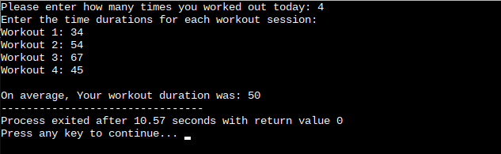

# Questions/Solutions

# !! Hello World! Program and Operators

## Problem Statement #01

>

```C++
//Solution
#include <iostream>

main()
{
	  std::cout << "Hello, World!\n";
	  
	  int x;
	  float y;
	  char z;
	  
	  std::cout << "Please enter an integer: ";
	  std::cin >> x;

	  std::cout << "Please enter a float: ";
	  std::cin >> y;

	  std::cout << "Please enter an character: ";
	  std::cin >> z;
	  
	  std::cout << "You entered the integer: " << x << std::endl;

	  std::cout << "You entered the float: " << y << std::endl;

	  std::cout << "You entered the character: " << z << std::endl;
	
	  return 0;
}
```

>

## Problem Statement #02

### Area and Perimeter Calculation of Geometrical Shapes:


```C++
//Solution
#include <iostream>
#include <cmath>

main()
{
	  const double Pi = M_PI;
	
	  std::cout << "Circle Calculations\n";
	  
	  float r,circum, areaOfCircle;
	  
	  std::cout << "Please enter the radius of circle: ";
	  std::cin >> r;
	  
	  circum = 2 * Pi * r;
	  std::cout << "Circumference of the circle: " << circum << "\n";
	  
	  areaOfCircle = Pi * r * r;
	  std::cout << "Area of the circle: " << areaOfCircle << "\n";
	  
	  
	  std::cout << "\nRectange Calculations\n";
	  
	  float l, w, perimeter, areaOfRectangle;
	  
	  std::cout << "Please enter length of the rectangle: ";
	  std::cin >> l;
	  
	  std::cout << "Please enter width of the rectangle: ";
	  std::cin >> w;
	  
	  perimeter = 2 * (l + w);
	  std::cout << "Perimeter of the rectangle: " << perimeter << "\n";
	  
	  areaOfRectangle = l * w;
	  std::cout << "Area of the rectangle: " << areaOfRectangle << "\n";

	  return 0;
}
```


## Problem Statement #03

### Temperature Conversion Program:


```C++
//Solution
#include <iostream>
using namespace std;

main()
{
	  char unit;
	
	  cout << "Enter the unit of temperature (use 'F', 'C', or 'K'): ";
	  cin >> unit;
	  
	  double temperature, celcius, kelvin, fahrenheit;
	  
	  cout << "Please enter temperature: ";
  	  cin >> temperature;

   	  if(unit == 'F'){
        //in every block value of temurature varies.
        //Here temperature = temperature in fahrenheit.
		 cout << "Temperature in Fahrenheit: " << temperature << "°F\n";

		 celcius = (temperature - 32) * 5 / 9;
		 cout << "Temperature in Celcius: " << celcius << "°C\n";
		 
		 kelvin = celcius + 273.25;
		 cout << "Temperature in Kelvin: " << kelvin << "°K\n";
	  }else if(unit == 'C'){
        //Here temperature = temperature in celcius.
		 cout << "Temperature in Celcius: " << temperature << "°C\n";
		 
		 fahrenheit = (temperature * 9 / 5) + 32;
		 cout << "Temperature in Fahrenheit: " << fahrenheit << "°F\n";
		 
		 kelvin = temperature + 273.25;
		 cout << "Temperature in Kelvin: " << kelvin << "°K\n";
	  }else if(unit == 'K'){
        //Here temperature = temperature in kelvin.
 		cout << "Temperature in Kelvin: " << temperature << "°K\n";
 		
 		fahrenheit = (temperature - 273.15) * 9 / 5 + 32;
 		cout << "Temperature in Fahrenheit: " << fahrenheit << "°F\n";
 		
 		celcius = temperature - 273.15;
 		cout << "Temperature in Celcius: " << celcius << "°C\n";
	  }else{
	  	cout << "Invalid unit entered!";
	  };

	  return 0;
}
```


## Problem Statement #04

### Simple and Compound Interest Calculator


```C++
//Solution
#include <iostream>
#include <cmath> //For using pow() in calculating compound interest
using namespace std;

int main()
{

	  cout << "Simple and Compound interest calculator\n";
	  cout << "\nLoud Disclaimer:\n Interest is Haram. If you're looking for a shortcut to trouble, well, here you go.\n" << endl ;

	  int principal = 0, time = 0, n = 0;
	  float rate = 0;

	  // Input values from user
	  cout << "Enter the principal amount: ";
	  cin >> principal;
	  
	  cout << "Enter the annual interest rate (as a percentage): ";
	  cin >> rate;
	  
	  cout << "Enter the time (in years): ";
	  cin >> time;
	  
	  cout << "Enter the number of times interest is compounded per year: ";
	  cin >> n;
	  
	  // Calculating Interest
	  double simpleInterest;
	  simpleInterest = (principal * rate  * time) / 100;
	  
	  double compoundInterest;
	  compoundInterest = principal * pow((1 + rate / (n * 100)) , (n * time)) - principal;
	  
	  cout << "Simple Interest: " << simpleInterest << endl;
	  
	  cout << "Compound Interest: " << compoundInterest << endl;

	  return 0;
}
```

>

## Problem Statement #05

### Parallel and series resistances calculator

>

```C++
//Solution
#include <iostream>
#include <iomanip>
using namespace std;

int main()
{
	cout << "\nDisclaimer:\nThis program can calculate upto 5 resistances.\nSo, Do not try to overachieve, or look Smart.\n" << endl;
	
	int n;
	cout<< "Enter the number of resistors (1-5): ";
	cin >> n;
	
	double r1, r2, r3, r4, r5, rSeries = 0, rParallel = 0;
	
	if(n >= 0){
		cout<< "Enter the resistance values (in ohms):\n";
	}
	
	if(n >= 1){
		cout<< "Resistor 1: ";
		cin >> r1;
		
		rSeries += r1;
		rParallel += 1 / r1;
	}
	
	if(n >= 2){
		cout<< "Resistor 2: ";
		cin >> r2;
		
		rSeries += r2;
		rParallel += 1 / r2;
	}
	
	if(n >= 3){
		cout<< "Resistor 3: ";
		cin >> r3;
		
		rSeries += r3;
		rParallel += 1 / r3;
	}
	
	if(n >= 4){
		cout<< "Resistor 4: ";
		cin >> r4;
		bs ghr hi hota hu 
		rSeries += r4;
		rParallel += 1 / r4;
	}
	
	if(n >= 5){
		cout<< "Resistor 5: ";
		cin >> r5;
		
		rSeries += r5;
		rParallel += 1 / r5;
	}
	
	cout << "Equivalent Series Resistance: " << rSeries << " ohms" << endl;

	cout << fixed << setprecision(2);
	cout << "Equivalent Parallel Resistance: " << 1 / rParallel << " ohms" << endl;

	return 0;
}
```

>

---

# !! If-else / Switch Statements

## Problem Statement #01

### Voting eligibility checker

```C++
//Solution
#include <iostream>
using namespace std;

int main()
{

	cout << "\nDisclaimer:\nThis program can be sarcastic.\n" << endl;

	int age;
	
	cout << "Please enter your age: ";
	cin >> age;
	
	if(age >= 18){
		cout << "You can vote now! Use that power wisely... or ahmmmm." << endl ;
	}else{
		cout << "You're not eligible, You still need to grow more, Baby!" << endl;
	}

	return 0;
}
```

## Problem Statement #02

### Parking Fee Calculator

```C++
//Solution
#include <iostream>
using namespace std;

int main()
{

	cout << "\nParking Fee Calculator\n" << endl;

	int hour;
	cout << "Please enter how many hours you used the parking: ";
	cin >> hour;
	
	int charges = 0;
	
	// to check if the user parked more than 1 hour
	if(hour > 1){
		charges = (hour - 1) * 200; // For each hour after the first, charges Rs 200/hr
		cout << "You've to pay " << charges << " for " << hour << "hr. Thank You!";
	}else if(hour == 1){
		cout << "You do not have to pay for the first hour. Thank You!" << endl;
	}else{
		cout << "Invalid input. Parking duration can't be less than 1 hour.";
	}
	
	return 0;
}
```

>

## Problem Statement #03

### BMI Calculator

```C++
//SOlution
#include <iostream>
#include <iomanip> //For decimal precision
using namespace std;

int main()
{

	cout << "\nBMI Calculator App\n" << endl;

	double w = 0, h = 0;

	cout << "Please enter your weight in kg's: ";
	cin >> w;

	cout << "Please enter your height in meters: ";
	cin >> h;

	double BMI = 0;

	BMI = w / (h * h);

	cout << fixed << setprecision(2);

	if(BMI < 18.5){
		cout << "\nYou're Underweight, BABY! Grow more Plz." << endl;
		cout << "Your actual BMI is " << BMI;
	}else if(BMI >= 18.5 && BMI < 25){
		cout << "\nYou're Normal-Weighted, You deserve an apple!!" << endl;
		cout << "Your actual BMI is " << BMI;
	}else if(BMI >= 25 && BMI < 30){
		cout << "\nTake care a bit yourself, Over-Weighted DUDE!" << endl;
		cout << "Your actual BMI is " << BMI;
	}else if(BMI >= 30){
		cout << "\nSo sad! Obesity bruh" << endl;
		cout << "Your actual BMI is " << BMI;
	}

	cout << "\n\nBMI chart" << endl;
	cout << "BMI < 18.5 = Underweight" << endl;
	cout << "BMI 18.5 - 25 = Normal Weight" << endl;
	cout << "BMI 25 - 30 = Overweight" << endl;
	cout << "BMI 30+ = Obesity" << endl;

	return 0;
}
```
>

## Problem Statement #04

### Coffee Shop Menu

```C++
//Solution
#include <iostream>
using namespace std;

int main()
{

 	cout << "\nIqbal Coffee Shop Beverages Menu\n" << endl;
 	cout << "1. Espresso" << endl;
 	cout << "2. Latte" << endl;
 	cout << "3. Cappuccino" << endl;
 	cout << "4. Mocha" << endl;
 	
 	int n; //For choice
 	
 	cout << "Please select your preffered coffee beverage(1-4): " ;
 	cin >> n;
 	
 	switch(n){
 		case 1:
 			cout << "Your Espresso will be ready in 5 mins. Thank You!";
 			break;
	 case 2:
 			cout << "Your Latte will be ready in 3 mins. Thank You!";
 			break;
	 case 3:
 			cout << "Your Cappuccino will be ready in 7 mins. Thank You!";
 			break;
	 case 4:
 			cout << "Your Mocha will be ready in 3 mins. Thank You!";
 			break;
	 default:
	 	cout << "Invalid choice. Please select from cuurent menu. Thank You!";

		}

	return 0;
}
```

>

## Problem Statement #05

### Traffic light system

```C++
//Solution
#include <iostream>
using namespace std;

int main()
{

 	cout << "\nTraffic light system, Do not Take it Easy.\n" << endl;

	cout << "1. Red" << endl;
	cout << "2. Yellow" << endl;
	cout << "3. Green" << endl<< endl;
	
	int n; //For choice
	
	cout << "Please select the current signal out there (1-3): ";
	cin >> n;
	
	switch(n){
		case 1:
			cout << "Please STOP! Do not rush, Wait for your Turn";
			break;
		case 2:
			cout << "Buckle up and Proceed with caution! Your turn is ahead.";
			break;
		case 3:
			cout << "Go bruhh";
			break;
		default:
			cout << "Invalid choice, Please choose from (1-3)";
	}

	return 0;
}
```

>

---
---

# !! Loops

## Problem Statement #0.1

### Factorial Calculator

```C++
//Solution
#include <iostream>
using namespace std;

int main()
{
	
	cout << "\nFactorial Calculator\n" << endl;

	int number;
	
	cout << "Please enter the number: ";
	cin >> number;
	
	int factorial = 1;
	
	while(number >= 1){
		factorial = factorial * number;
		number = number - 1;
	}
	
	cout << "The Factorial is: " << factorial;

	return 0;
}
```

>

## Problem Statement #01

### Exponent Calculator for a given number

```C++
//Solution
#include <iostream>
using namespace std;

int main()
{

	cout << "\n'Exponent' Calculator for a given number\n" << endl;

	double x = 0; //Number
	int n ; //Exponent

	cout << "Please enter a number: ";
	cin >> x;

	cout << "Please enter an exponent(1,2,3...n): ";
	cin >> n;

	int counter = 1; // For checking if x is multiplied certain times.
	double result = 1;

	if(n == 0){
		cout << "For " << x << "^0, It becomes = 1" << endl;
	}else{
		while(counter <= n){
			result = result * x;
			counter = counter + 1;
		}
	cout << "\n" << x << "^" << n << " will be calculated as: " << result;
	}

	
	return 0;
}
```

>

## Problem Statement #0.2

### Table calculator

```C++
//Solution
#include <iostream>
using namespace std;

int main()
{

	cout << "\nTable Calculator\n" << endl;
	
	int n;
	
	cout << "Please enter a number: ";
	cin >> n;
	
	int maxMultiplier;
	
	cout << "Please enter maximum multiplier number: ";
	cin >> maxMultiplier;
	
	for(int i = 1; i<=maxMultiplier; i++){
		cout << n << " x " << i << " = " << n * i << endl;
	}
	
	
	return 0;
}
```

>

## Problem Statement #0.3

### 'Hardcoded number' Guessing Game

```C++
//Solution
#include <iostream>
using namespace std;

int main()
{
	//This program will allow users to guess a number from a to z
	//do-while construct is used to allow five tries

	cout << "\nNumber Guessing Game\n" << endl;
	
	char guessChar;
	char answer = 'z';
	int tryNum = 1;
	
	
	//'do' will ask for input, and compares it.
	do{
		cout << "Please enter the character(a to z): ";
		cin >> guessChar;
	
		//check the entered character for equality
		if(guessChar == answer){
			cout << "You guessed it right";
		}else{
			
	  		//this condition will show error message differently for the last try
			if(tryNum == 5){
				cout << "Better luck Next time";
			}else{
				cout << "Please Try again" << endl;
			}
			
		}
		tryNum = tryNum + 1;
		
	//while will loop until user guess isn't correct and user doesn't hit max number of tries
	}while(tryNum <= 5 && guessChar != answer);
	
	return 0;
}
```

>

## Problem Statement #2

### Prime Number Check

```C++
//Solution
#include <iostream>
using namespace std;

int main()
{
	//This program will check if given number is prime or not.

	cout << "\nPrime number check program\n" << endl;
	
	int n = 0;
	
	cout << "Please enter a number: ";
	cin >> n;
	
	
	//Counter will be used to check how many times a number can be divided without itself.
	int counter = 0;
	
	//if n is less then or equal to 1 it'll not be a prime number.
	//2 is always a prime number, No, need to check for 2.
	if(n <= 1){
		cout << n << " is not a prime number ";
	}else if(n == 2){
		cout << "2 is a prime number";
	}else{
		//it'll check until n-1, we all know n can always be divided by itself.
		for(int i = 2; i < n; i++){
			if(n % i == 0){
				//counter will tell us if n is divided, then how many times, instead itself.
				counter++;
			}
		}

		//if n isn't completely divided a single time, it means it can just be divided on itself.
		if(counter == 0){
			cout << n << " is a prime number";
		}else{
			cout << n << " is not a prime number";
		}
	}
	
	
	return 0;
}
```

>

## Problem Statement #3

### Password Verification

```C++
//Solution
#include <iostream>
#include <string>
using namespace std;

int main()
{
	//This program will verify if user entered password is correct by comparing 2 strings.

	cout << "\nPassword Verification\n" << endl;
	
	string password = "password123";
	string checkPass;
	
	do{
		cout << "Please enter the password: ";
		cin >> checkPass;
		
		if(checkPass != password){
			cout << "Incorrect password. Please try again." << endl;
		}
	}while(checkPass != password);

	cout << "You've entered the correct password.";

	return 0;
}
```

>


## Problem Statement #04

### Shape Printing -Square/Right angle Triangle

```C++
//Solution
#include <iostream>
using namespace std;

int main()
{
	//This program will print shapes using nested loops.

	cout << "\nShape Printing:\n" << endl;
	
	cout << "1. Triangle" <<endl;
	cout << "2. Square\n" <<endl;
	
	int choice, size;
	
	cout << "Please Enter your choice: ";
	cin >> choice;

	
	
	switch(choice){
		case 1:
			cout << "Please Enter the size of the Triangle: ";
			cin >> size;
			cout << endl;
			
			for(int i = 1; i <= size; i++){
				for(int j = 1; j <= i; j++){
					cout << " * ";
				}
				cout<< endl;
			}
			break;
			
		case 2:
			cout << "Please Enter the size of the Square: ";
			cin >> size;
			cout << endl;
			
			for(int i = 1; i <= size; i++){
				for(int j = 1; j <= size; j++){
					cout << " * ";
				}
				cout << endl;
			}
			break;
			
		default:
			cout << "Please choose a valid option next time(1 or 2).";
	}

	return 0;
}
```

>

## Problem Statement #0.4

### Shape printing - Big Victory V

```C++
//Solution
#include <iostream>
using namespace std;
int main(){
	char x ;
	cout << "Please enter a character to print big victory: ";
	cin >> x;
	
	int maxRows;
	cout << "Please enter size of big victory: ";
	cin >> maxRows;
	
	for(int i=0; i<maxRows; i++){
		for(int s=0; s<i; s++){
			cout << " ";
		}
		
		if(i < maxRows -1){
			cout << x;
			for(int s=0; s<2*(maxRows - i) - 3; s++){
				cout << " ";
			}
			cout << x << "\n";
		}else{
			cout << x;
		}
	}
	
	return 0;
}
```

>


## Problem Statement #05

### Grade Calculator

```C++
//Solution
#include <iostream>
using namespace std;

int main()
{
	//This program will calculate student grades.

	int choice, score;

	do{
		cout << "\nGrade Calculator Menu:\n";
		cout << "1. Calculate Grade\n";
		cout << "2. Exit\n";
		
		cout << "Please enter your choice: ";
		cin >> choice;
		
		switch(choice){
			case 1:
				cout << "Please enter student's score: ";
				cin >> score;
				
				if(score < 0 || score > 100){
					cout << "Invalid score! Please enter a value between 0 and 100\n";
				}
				else if(score >= 90){
					cout << "Grade: A\n";
				}else if(score >= 80){
					cout << "Grade: B\n";
				}else if(score >= 70){
					cout << "Grade: C\n";
				}else if(score >= 60){
					cout << "Grade: D\n";
				}else {
					cout << "Grade: F\n";
				}
				break;
			case 2:
				cout << "Exiting..\n";
				break;
			default:
				cout << "Please enter a valid option\n";
		};
	}while(choice != 2);
	
	

	return 0;
}
```

>

---
---

# !! Functions

## Problem Statement #0.1

### Square calculator

```C++
//Solution
#include <iostream>
using namespace std;

//This function will return a number's square.

double square(double i){
	return i * i;
}

int main(){
	
	double n;
	cout << "Please enter a number to be squared: ";
	cin >> n;
	
	cout << "The square of " << n << " is " << square(n) << ".\n";
	
	return 0;
}
```

>

## Problem Statement #0.2

### Power calculator for a number

```C++
//Solution
#include <iostream>
using namespace std;

//This function will calculate some power for a base number.

double raiseToPow(double base, int power){

	   //In multiplication, initialize result with 1.
	   double result = 1.0;

	   if(power < 0){
	   	for(int i=0; i < -(power); i++){
	   		result *= base;
		   }
		   
	    return 1/result;
	    
	   }else{
	   	for(int i=0; i<power; i++){
	   	result *= base;
	   }

	    return result;
	   
	   }
};

int main(){

	cout << "\nx^y Calculator\n" << endl;

	double x;
	int y;

	cout << "Please enter a base number: ";
	cin >> x;

	cout << "Please enter the power for which base will be raised to: ";
	cin >> y;
	
	cout << "\n" << x << "^" << y << " comes as " << raiseToPow(x, y) << ".\n";

	return 0;
}
```

>

## Problem Statement #0.3

### Area of ring calculator

```C++
//Solution
#include <iostream>
using namespace std;

double circleArea(double radius){
	return 3.14 * radius *radius;
}

int main(){

	cout << "\nArea of ring calculator.\n" << endl;

	double outerRad, innerRad;

	cout << "Please enter the radius of outer circle: ";
	cin >> outerRad;
	
	if(outerRad <= 0){
		cout << "Invalid input, Outer radius must be greater than zero.\n";
		
	}else{
		cout << "Please enter the radius of inner circle: ";
		cin >> innerRad;

		if(innerRad > outerRad || innerRad <= 0){
					cout << "Invalid input, Inner radius must be greater than zero and less than Outer radius.\n";
  		}else{
			  cout << "\nArea of the ring comes out to be: " << circleArea(outerRad) - circleArea(innerRad);
		  }
	}

	return 0;
}
```

>


## Problem Statement #01

### Average workout duration calculator

```C++
//Solution
#include <iostream>
using namespace std;

//This function will calculate student grades.

double avgWorkoutDur(int array[], int arraySize){
	
	double sum = 0.0;

	for(int i = 0; i < arraySize; i++){
		sum += array[i];
	};

	return sum /arraySize;
}

int main()
{
	
	int durArray[100];
	int arraySize;
	
	cout << "Please enter how many times you worked out today: ";
	cin >> arraySize;
	
	if(arraySize <= 0 || arraySize > 100){
		cout << "Invalid number of workouts" <<endl;
		return 1; //Exit program
	}
	
	cout << "Enter the time durations for each workout session: " << endl;
	for(int i = 0; i < arraySize; i++){
		cout << "Workout " << i + 1 << ": ";
		cin >> durArray[i];
		
	}
	
	cout << "\nOn average, Your workout duration was: " << avgWorkoutDur(durArray, arraySize);

	return 0;
}
```

>

## Problem Statement #02

### A function to calculate costs of items in cart

```C++
//Solution
#include <iostream>
using namespace std;

double calcTotalPrice(double price[], int quantity[], int arraySize){

	double sum = 0;

	for(int i=0; i<arraySize; i++){
		sum += (price[i] * quantity[i]);
	}

	return sum;
}

int main(){

	cout << "\nTotal cost of items Calculator in cart.\n" << endl;

  	double price[100];
  	int quantity[100];

	int totalProducts;

	cout << "Please enter number of total products: ";
	cin >> totalProducts;

	// Validate input range
	if(totalProducts <= 0 || totalProducts > 100){
		cout << "Invalid number of products.\n";
	}else{
 		  // Input prices & quantities with validation
		for(int i=0; i<totalProducts; i++){
			while(true){
				cout << "\nPlease enter price of product " << i+1 << ": ";
				cin >> price[i];

				cout << "Please enter it's quantity: ";
				cin >> quantity[i];

				if(price[i] > 0 && quantity[i] > 0){
					break;
				}else{
					  cout << "\nInvalid input. Price or quantity must be greater than 0.\n";
				}
			}
				
		}
		cout << "\nTotal cost = " << calcTotalPrice(price, quantity, totalProducts);
	}

	return 0;
}
```

>

## Problem Statement #03

### Employee bonus calculator as per Performance rating

```C++
//Solution
#include <iostream>
using namespace std;

double calcBonus(int empID, int performanceRating, double salary){

	double bonus = 0.0;

	if(performanceRating >= 4){
		bonus = (10.0 / 100) * salary;
  		cout << "\nYou are a High Performer!";
	}else if(performanceRating == 3){
		bonus = (5.0 / 100) * salary;
  		cout << "\nYou are an Average Performer!";
	}else{
		cout << "\nYou just performed below-average, Good luck next time.";
	}

	return bonus;
}

int main(){

	cout << "\nEmployee bonus calculator.\n" << endl;

	int empID;
	int empRating;
	double salary;

	cout << "Please enter your unique EmployeeID: ";
	cin >> empID;

	while(true){
		cout << "Please enter your Performance Rating (1-5): ";
		cin >> empRating;
		if(empRating <= 5 && empRating  > 0){
			break;
		 }else{
		 	cout << "\nInvalid input, Your Performance Rating must be in between 1 and 5" << endl;
		 }
	}
	
	cout << "Please eanter your salary: ";
	cin >> salary;

	double empBonus;
	empBonus = calcBonus(empID, empRating, salary);
	cout << "\nYour Final Bonus amount = Rs. " << empBonus << endl;

	return 0;
}
```

>

## Problem Statement #04

### Simple Interest calculator

```C++
//Solution
#include <iostream>
#include <iomanip>
using namespace std;

double calcInterest(double principal, double rate, double time){
	return (principal * rate * time) / 100;
}

int main(){
	
	cout << "\nSimple Interest Calculator\n" << endl;
	
	double principal, rate, time;
	
	cout << "Please enter Initial Balance in the savings account: ";
	cin >> principal;
	
	cout << "Please enter Interest Rate: ";
	cin >> rate;
	
	cout << "Please enter Time Period in year: ";
	cin >> time;
	
	if (principal < 0 || rate < 0 || time < 0) {
       cout << "\nInvalid input. Values must be non-negative.\n";
    	 return 1; // Exit program with an error
	}else if(rate > 100){
		cout << "\nInterest rate must be less than 100%";
		return 1;
	}
	
	cout << fixed << setprecision(2);
	
	cout << "\nFor Rs." << principal << ", Rs." << calcInterest(principal, rate, time) <<
 	" will be earned over Time Period of " << time << " year.";
	
	return 0;
}
```

>

## Problem Statement #0.4

### Your left age calculator in weeks out of 90 years

```C++
//Solution
#include <iostream>
using namespace std;

double lifeInWeeks(double age){
	return age * 52.17;
}

int main(){
	
	cout << "\nThe HORROR story begins here.\n";
	cout << "Your remaining age Calculator in weeks, If your age is 90 years!!\n" << endl;
	
	double age;
	
	while(true){
		cout << "Please enter your current age: ";
		cin >> age;
		
		if(age > 0 && age < 90){
			break;
		}else{
			cout << "\nYour current age must be greater than 0 and less than 90 ." << endl;
		}
	}
	
	
	cout << "\nYou have just " << lifeInWeeks(90)-lifeInWeeks(age) << " weeks left.\n";
	cout << "Kill Your BIG EGO, LOVE YOURSELSF & LIVE ITT!";
	
	return 0;
}
```

>

## Problem Statement #05

### Employee Salary Calculator

```C++
//Solution
#include <iostream>
using namespace std;

double calcSalary(double hourlyRate, double workedHrs, double overTimeHrs, double overTimeRate){

	return (hourlyRate * workedHrs) + (overTimeHrs * overTimeRate);
}

int main(){
	
	cout << "\nEmployees total salary calculation.\n" << endl;

	double baseRate, overTimeRate, overTime, hrsWorked;

	// Input & validation
    do {
        cout << "Enter base rate per hour: ";
        cin >> baseRate;
        if (baseRate <= 0) cout << "Invalid rate! Must be greater than zero.\n";
    } while (baseRate <= 0);

    do {
        cout << "Enter hours worked: ";
        cin >> hrsWorked;
        if (hrsWorked < 0) cout << "Hours cannot be negative.\n";
    } while (hrsWorked < 0);

    do {
        cout << "Enter overtime hours: ";
        cin >> overTime;
        if (overTime < 0) cout << "Overtime hours cannot be negative.\n";
    } while (overTime < 0);

    do {
        cout << "Enter overtime rate per hour: ";
        cin >> overTimeRate;
        if (overTimeRate < 0) cout << "Overtime rate cannot be negative.\n";
    } while (overTimeRate < 0);

	
	cout << "\nYour total salary = Rs." << calcSalary(baseRate, hrsWorked, overTime, overTimeRate);
		
	return 0;
}
```

>

## Problem Statement #0.5

### Factorial calculator using Recursive Function

```C++
//Solution
#include <iostream>
using namespace std;

long factorial(int n){
	if( n == 1 || n == 0){
		return n;
	}else{
		return (n * factorial(n - 1));
	}
}
int main(){
	int x;
	
	do{
	cout << "Please enter a number to calculate factorial: ";
	cin >> x;
	
	if(x < 0){
		 cout << "Number must be positive." << endl;
	}
	}while(x < 0);

	
	cout << "Factorial of " << x << " = " << factorial(x) <<endl;

	return 0;
}
```
>

## Problem Statement #0.6

### Power calculator using Recursive Function

```C++
//Solution
#include <iostream>
using namespace std;

long pow(double x, int y){
//	 if(y == 1)
//	 	return x;  //this case is already handeled below.
	 if(y == 0){
	 	return 1;
	 }else if(y < 0){
	 	y = -(y); //convert -ve exponent to +ve.
	 	return 1.0/(x * pow(x, y-1)); //here, '1.0' is just to escape integer division
	 }else{
	 	return x * pow(x, y-1);
	 }
}
int main(){
	double base;
	int exp;
	
	cout << "Please enter a base number: ";
	cin >> base;

	cout << "Please enter exponent: ";
	cin >> exp;

	cout << base << "^" << exp << " = " << pow(base, exp);
	
	
	return 0;
}
```

>

# !! Arrays

## Problem Statement #01

### Display elements horizontly separated by a tab

```C++
//Solution
#include <iostream>
using namespace std;
int main(){
	int arr[100], sizeOfArr; //Defining array size at declaration is compulsory.

	do{
		cout << "Please enter size of Array: ";
		cin >> sizeOfArr;
		
		if(sizeOfArr <= 0 || sizeOfArr > 100){
			cout << "Invalid Input. Size of Array must be in between 1 and 100."<<endl;
		}
	}while(sizeOfArr <= 0 || sizeOfArr > 100);
	
	
	cout << "\nPlease enter " << sizeOfArr << " array elements (integers): \n";
	
	for(int i = 0; i < sizeOfArr; i++){
		cout << i+1 << ".";
		cin >> arr[i];
	}
	
	cout << "\nHorizontal List of Array elements is: \n";
	for(int i = 0; i < sizeOfArr; i++){
		cout << arr[i] << "\t";
	}
	
	return 0;
}
```

>

## Problem Statement #02

### Find max, min and average height

```C++
//Solution
#include <iostream>
#include <iomanip>
using namespace std;

//Function to find maximum element
double maximum(double array[], int sizeOfArray){
	double max = array[0]; //Initialize with first element of array
	for(int i = 1; i<sizeOfArray; i++){ //start from second element
		if(array[i] > max){
			max = array[i];
		}
	}
	return max;
}

//Function to find minnimum element
double minimum(double array[], int sizeOfArray){
	double min = array[0]; //Initialize with first element of array
	for(int i = 1; i<sizeOfArray; i++){ //Start comparing from second element
		if(array[i]<min){
			min = array[i];
		}
	}
	return min;
}

//Function to find average of all the elements of array
double average(double array[], int sizeOfArray){
	double sum = 0;
	for(int i = 0; i < sizeOfArray; i++){
		sum += array[i];
	}
	return sum / sizeOfArray;
}

int main(){

	const int sizeOfArray = 6;
	double height[sizeOfArray] = {};
	
	cout << "Please enter heights of players: \n";
	for(int i = 0; i< sizeOfArray; i++){
		do{
			cout << i+1 << ". ";
			cin >> height[i];
			if(height[i] <= 0){
				cout << "\nInvalid Input, Height must be greater than 0." <<endl;
			}
		}while(height[i] <= 0);
		
	}

	cout << "\nHeights of players are: \n";
	for(int i = 0; i<sizeOfArray; i++){
		cout << height[i] << "\t";
	}
	
	cout << "\n\nMaximum height of player is " << maximum(height, sizeOfArray) <<endl;

	cout << "\nMinimum height of player is " << minimum(height, sizeOfArray) <<endl;
	
	cout << fixed << setprecision(1);
	cout << "\nAverage height of player is " << average(height, sizeOfArray)<< endl;

	return 0;
}
```

>

## Problem Statement #03 

### Sort elements of array in ascending order

```C++
//Solution
#include <iostream>
using namespace std;
void ascSort(int array[], int sizeOfArr){
	int minIndex, temp;

	for(int i=0; i<sizeOfArr-1; i++){
		minIndex = i;
		for(int j= i+1; j < sizeOfArr; j++){
			if(array[j] < array[minIndex]){
				minIndex = j;
			}
		}

		if(minIndex != i){
			temp = array[i];
			array[i] = array[minIndex];
			array[minIndex] = temp;
		}
	}
}
int main(){
	int array[100], sizeOfArr;

	do{
		cout << "Please enter size of array: ";
		cin >> sizeOfArr;

		if(sizeOfArr < 1){
			cout << "\nInvalid Input, Array size must be greater than 0.";
		}
	}while(sizeOfArr < 1);

	cout << "Please enter unsorted array elements one by one: \n";
	for(int i = 0; i<sizeOfArr; i++){
		cout << i+1 << ". ";
		cin >> array[i];
	}

	ascSort(array, sizeOfArr);
	
	cout << "\nThe sorted integer list is: \n";
	for(int i = 0; i<sizeOfArr; i++){
		cout << array[i] << "\t";
	}

	return 0;
}
```

>

## Problem Statement #0.2

### Reverse print your name/message

```C++
//Solution
#include <iostream>
using namespace std;

void reverseName(char name[], int arraySize){
	
	//Using two two pointers to iterate on characters from both side.
	int left = 0, right = arraySize - 1;
	
	while(left < right){
		
		//Swapping first and last characters until left index is less than right.
		char temp = name[left];
		name[left] = name[right];
		name[right] = temp;
		
		//Moving pointers
		left++;
		right--;
	}
}

int main(){
	char name[100];
	cout << "Please enter your name: ";
	cin.getline(name, 1000); //it'll get whole line, including spaces.

	int size = 0;
	while(name[size] != '\0'){
		size++;
	}

	//By default call by reference in arrays.
	reverseName(name, size);
	
	cout << "\nReversed: ";
	for(int i = 0; i < size; i++){
		cout << name[i];
	}

	return 0;
}
```

>

## Problem Statement #0.3

### Populating and printing 2-D array

```C++
//Solution
#include <iostream>
using namespace std;
int main(){
	const int maxRows = 3;
	const int maxCols = 3;
	char x[maxRows][maxCols];
	for(int row = 0; row < maxRows; row++){
		for (int col = 0; col < maxCols; col++){
			cout << "Please enter value of row " << row << ", col " << col << ": ";
			cin >> x[row][col];
		}
	}
	
	cout << "\nYour 2-D populated matrix is: \n";
	for(int row = 0; row < maxRows; row++){
		for (int col = 0; col < maxCols; col++){
			cout << x[row][col] << " ";
		}
		cout << endl;
	}
	
	
	return 0;
}
```

>

## Problem Statement #04

### Populate and print 2-D array as matrix

```C++
//Solution
#include <iostream>
using namespace std;
int main(){
	const int maxRows = 3;
	const int maxCols = 4;
	int x[maxRows][maxCols];

//	initializing the matrix
	for(int i = 0; i < maxRows; i++){
		cout << "\nPlease enter row " << i+1 << " elements: \n";
		for(int j = 0; j < maxCols; j++){
			cin >> x[i][j];
		}
	}

//  displaying the matrix
	cout << "\nArray elements in matrix form are: \n" << endl;
	for(int i = 0; i< maxRows; i++){
		for(int j = 0; j<maxCols; j++){
			cout << x[i][j] << "\t";
		}
		cout << "\n" << endl;
	}

	return 0;
}
```

>

## Problem Statement #05

### Take students quizz score, calc sum, avg, print in array

```C++
//Solution
#include <iostream>
#include <iomanip>
using namespace std;
int main(){
	const int maxRows = 4;
	const int maxCols = 3;
	float array[maxRows][maxCols];

	//Taking inputs
	for(int i=0; i<maxRows; i++){
		cout << "\nPlease enter student " << i+1 << " score: \n";
		for(int j=0; j<maxCols; j++){
			cin >> array[i][j];
		}
	}

	//Printing in the matrix pattern
	cout << "\nStudent quizzes score with sum and average: \n" << endl;
	cout << "\tQuizz 1\tQuizz 2\tQuizz 3\tSum\tAvg\n" << endl;
	
	cout << fixed << setprecision(1);
	
	for(int i=0; i<maxRows; i++){
		float sum = 0, avg;
		cout << "Stud " << i+1 << "\t";
		for(int j=0; j<maxCols; j++){
			sum += array[i][j];
			cout << array[i][j]<< "\t";
		}
		avg = sum / maxCols;
		cout << sum << "\t" << avg << "\n" << endl;
	}


	return 0;
}
```

>

## Problem Statement #0.4

### Print Row-reversed 2-D 3-by-3 array

```C++
//Solution
#include <iostream>
using namespace std;
int main(){
	const int maxRows = 3;
	const int maxCols = 3;
	
	int array[maxRows][maxCols];
	
	for(int row=0; row<maxRows; row++){
		 cout << "Please enter elements of row " << row+1 << endl;
		 for(int col=0; col<maxCols; col++){
		 	cin >> array[row][col];
		 }
	}
	
	cout << "\nYour inputed array is: \n";
	for(int row=0; row<maxRows; row++){
		for(int col=0; col<maxCols; col++){
			cout << array[row][col] <<" ";
		}
		cout <<"\n";
	}
	
	cout << "\nRow reversed array is: \n";
	for(int row=maxRows-1; row>=0; row--){
		for(int col=0; col<maxCols; col++){
			cout << array[row][col] <<" ";
		}
		cout <<"\n";
	}
	
	return 0;
}
```

>

## Problem Statement #0.5

### Print col-reversed 2-D 3-by-3 array

```C++
//Solution
#include <iostream>
using namespace std;
int main(){
	const int maxRows = 3;
	const int maxCols = 3;
	
	int array[maxRows][maxCols];
	
	for(int row=0; row<maxRows; row++){
		 cout << "Please enter elements of row " << row+1 << endl;
		 for(int col=0; col<maxCols; col++){
		 	cin >> array[row][col];
		 }
	}
	
	cout << "\nYour inputed array is: \n";
	for(int row=0; row<maxRows; row++){
		for(int col=0; col<maxCols; col++){
			cout << array[row][col] <<" ";
		}
		cout <<"\n";
	}
	
	cout << "\nCol reversed array is: \n";
	for(int row=0; row<maxRows; row++){
		for(int col=maxCols-1; col>=0; col--){
			cout << array[row][col] <<" ";
		}
		cout <<"\n";
	}
	
	return 0;
}
```

>

## Problem Statement #0.6

### Transpose of a Square Matrix -from using upper diagonal triangle

```C++
//Solution
#include <iostream>
using namespace std;

int main(){
	const int maxRows = 3;
	const int maxCols = 3;
	
	int array[maxRows][maxCols];
	
	for(int row=0; row<maxRows; row++){
		 cout << "Please enter elements of row " << row+1 << endl;
		 for(int col=0; col<maxCols; col++){
		 	cin >> array[row][col];
		 }
	}
	
	cout << "\nOriginal array is: \n";
	for(int row=0; row<maxRows; row++){
		for(int col=0; col<maxCols; col++){
			cout << array[row][col] << " ";
		}
		cout <<"\n";
	}
	
	for(int row=0; row<maxRows; row++){
		//initialize col by row, to skip already swapped elements
		for(int col=row; col<maxCols; col++){ 
			//Diagonal values will not be swapped
			if(row != col){
				//Now, we'll be swapping upper diagonal triangle with lower
				int temp;
				temp = array[row][col];
				array[row][col] = array[col][row];
				array[col][row] = temp;
			}
		}
	}
	
	cout << "\nTransposed array is: \n";
	for(int row=0; row<maxRows; row++){
		for(int col=0; col<maxCols; col++){
			cout << array[row][col] << " ";
		}
		cout <<"\n";
	}
	
	return 0;
}
```

>

## Problem Statement #0.7

### Transpose of a Square Matrix -from using lower diagonal triangle

```C++
//Solution
#include <iostream>
using namespace std;

int main(){
	const int maxRows = 3;
	const int maxCols = 3;
	
	int array[maxRows][maxCols];
	
	for(int row=0; row<maxRows; row++){
		 cout << "Please enter elements of row " << row+1 << endl;
		 for(int col=0; col<maxCols; col++){
		 	cin >> array[row][col];
		 }
	}
	
	cout << "\nOriginal array is: \n";
	for(int row=0; row<maxRows; row++){
		for(int col=0; col<maxCols; col++){
			cout << array[row][col] << " ";
		}
		cout <<"\n";
	}
	
	for(int row=0; row<maxRows; row++){
		//initialize col by row, to skip already swapped elements
		for(int col=row; col<maxCols; col++){ 
			//Diagonal values will not be swapped
			if(row != col){
				//Now, we'll be swapping lower diagonal triangle with upper
				int temp;
				temp = array[col][row];
				array[col][row] = array[row][col];
				array[row][col] = temp;
			}
		}
	}
	
	cout << "\nTransposed array is: \n";
	for(int row=0; row<maxRows; row++){
		for(int col=0; col<maxCols; col++){
			cout << array[row][col] << " ";
		}
		cout <<"\n";
	}
	
	return 0;
}
```

>


## Problem Statement #0.8 

### Real World Problem #01 - Calculating how many employees get greater gross salary but less net salary in comparison with others having less gross but higher net salary, due to income tax slab variations

```C++
//Solution
#include <iostream>
using namespace std;

void getInput(double sal[][2], int numEmps){
	cout << "\nPlease enter gross salary of: " << endl;
	for(int i=0; i<numEmps; i++){

//      Salary input validation, Salary must be greater than 0
		do{
			cout <<"Employee number " << i+1 << ". ";
//			Just getting Gross salaries in first column.
			cin >> sal[i][0];

			if(sal[i][0] < 1){
				cout <<"\nInvalid input, Salary must be greater than 0" <<endl;
			}
		}while(sal[i][0] < 1);
	}
}

void calcNetSal(double sal[][2], int numEmps){
//   Calaculating net salary as per different income tax slabs
//   Net salary = gross salary - tax

	for(int i=0; i<numEmps; i++){
		if(sal[i][0] <= 5000){
//			There's no tax deduction
			sal[i][1] = sal[i][0];
		}else{
			if(sal[i][0] <= 10000){
//				The tax deduction is 5%
				sal[i][1] = sal[i][0]-(0.05 * sal[i][0]);
			}else{
				if(sal[i][0] <= 20000){
//					The tax deduction is 10%
					sal[i][1] = sal[i][0]-(0.10 * sal[i][0]);
				}else{
//					The tax deduction is 15%
					sal[i][1] = sal[i][0]-(0.15 * sal[i][0]);
				}
			}
		}
		
		
//		if(sal[i][0] <= 5000){
////			There's no tax deduction
//			sal[i][1] = sal[i][0];
//		}else if(sal[i][0] >= 5001 && sal[i][0] <= 10000){
////			The tax deduction is 5%
//			sal[i][1] = sal[i][0]-(0.05 * sal[i][0]);
//		}else if(sal[i][0] >= 10001 && sal[i][0] <= 20000){
////			The tax deduction is 10%
//			sal[i][1] = sal[i][0]-(0.10 * sal[i][0]);
//		}else if(sal[i][0] >= 20001){
////			The tax deduction is 15%
//			sal[i][1] = sal[i][0]-(0.15 * sal[i][0]);
//		}

	}
}

void locUnluckyInd(double sal[][2], int numEmps, int lucky[]){
	int grossSal, netSal;
	
//	For each employee in a row, We'll compare it's(G.S and N.S) with whole column.
//  We'll mark unlucky if his gross salary is greater but net salary is less than his any of the peer.
	for(int row=0; row<numEmps; row++){
		grossSal = sal[row][0];
		netSal = sal[row][1];
		for(int col=0; col<numEmps; col++){
			if(grossSal > sal[col][0] && netSal < sal[col][1]){
				lucky[row] = 1;
			}
		}
	}
}

void outFinalSal(double sal[][2], int numEmps){
	cout << "Employees\tGross Salary\tNet Salary\n";
	for(int row=0; row<numEmps; row++){
		cout << "Employee " << row+1 <<": \t";
		for(int col=0; col<2; col++){
			cout << sal[row][col] << "\t\t";
		}
		cout << "\n";
	}
}

void outUnlucky(int lucky[], int numEmps){
 cout << "\nThese following employees are unlucky: "<<endl;
	for(int i=0; i<numEmps; i++){
		if(lucky[i] == 1){
			cout << "Employee number " << i+1 <<endl;
		}
	}
}

int main(){
	int numEmps;
//	Suppose max employees are 100, So initialize rows with 100.
//	There'll just be 2 rows, first for Gross salary and second for Net salary. So, Hardcoded it.
	const int arraySize = 100;
	double sal[arraySize][2];

//  Read the actual number of employees in the company
//	For number of employees validation
	do{
		cout << "Please enter total number of employees: ";
		cin >> numEmps;

		if(numEmps > 100 || numEmps < 1){
			cout << "Invalid Input, Number of employees must be in between 1 and 100." << endl;
		}
	}while(numEmps > 100 || numEmps < 1);
	
//  We're assuming by-default all employees are lucky
	int lucky[arraySize];
	for(int i=0; i<numEmps; i++){
		lucky[i] = 0;
	}

//  Get gross salaries inputs from the user
	getInput(sal, numEmps);

//  Calculate net salaries as per income tax slabs, and store in 2nd column of array
	cout<<"\nCalculating net salaries...\n"<<endl;
	calcNetSal(sal, numEmps);

//	Display final G.S and N.S in tabular form
	outFinalSal(sal, numEmps);

//	Check for unlucky employees, whose G.S are higher but N.S are lesser then their peers
	cout<<"\nChecking for unlucky guys out of you..."<<endl;
	locUnluckyInd(sal, numEmps, lucky);
	
//	Display unlucky employees
	outUnlucky(lucky, numEmps);
	
	return 0;
}
```

>

## Problem Statement #0.9

### Check if the given matrix is identity matrix

```C++
//Solution
#include <iostream>
using namespace std;
int main(){
	const int arraySize = 3;
	int a[arraySize][arraySize];
	
	cout<<"\nYour goto identity matrix check\n"<< endl;

//	Reading the matrix
	for(int row=0; row<arraySize; row++){
		cout<<"Please enter elements of row " << row+1 <<endl;
		for(int col=0; col<arraySize; col++){
			cin >> a[row][col];
		}
	}

//  check = 0 means matrix is identity.
	cout << "\nChecking the given matrix..."<<endl;
	int check = 0;
	for(int row=0; row<arraySize; row++){
		for(int col=0; col<arraySize; col++){
			if(row == col){
				if(a[row][col] != 1){
					check++;
				}
			}else{
				if(a[row][col] != 0){
					check++;
				}
			}
		}
	}
	
//	Displaying the matrix
	cout << "\nYour given matrix is: "<<endl;
	for(int row=0; row<arraySize; row++){
		for(int col=0; col<arraySize; col++){
			cout << a[row][col] << " ";
		}
		cout << "\n";
	}

	if(check == 0){
		cout << "\nThis is an identity matrix."<<endl;
	}else{
		cout<<"\nThis is not an identity matrix."<<endl;
	}

	return 0;
}
```

>

---
---

# !! Pointers

## Problem Statement #01

### Display value of integer variable using pointer

```C++
//Solution
#include <iostream>
using namespace std;
int main(){
	
//	Declaring variable and pointer with NULL value
	int x = 0, *xptr = NULL;
	
//	Sending memory address reference of x to xptr
	xptr = &x;
	
 	cout << "Please enter an integer value: ";
 	cin >> x;
 	
 	cout << "\nThe entered integer value is: " << *xptr;
	
	return 0;
}
```

>

## Problem Statement #02

### Display elements of integer array using pointers

```C++
//Solution
#include <iostream>
using namespace std;
int main(){
	const int arraySize = 5;
	int a[arraySize], *ptr = NULL;
	
//	Reading values of a[]
	cout << "Please enter 5 integer values: "<<endl;
	for(int i=0; i<arraySize; i++){
		cout << "Enter value " << i+1 <<": ";
		cin >> a[i];
	}

	cout << "The entered integer values are: ";
	for(int i=0; i<arraySize; i++){
//		a[i], are just name of memory locations like variables
//		Instead a[arraySize is the address reference of that memory location
//      As per tradition, address refence of variable is sending to the pointer below.
		ptr = &a[i];
		cout << *ptr << " ";
	}


	return 0;
}
```

>

## Problem Statement #03

### Swap integer values using pointers

```C++
//Solution
#include <iostream>
using namespace std;
int main(){
	int x, y;
	int *xptr = &x, *yptr = &y;
	
	cout <<"Please enter the first integer value (x): ";
	cin >> x;

	cout <<"\nPlease enter the second integer value (y): ";
	cin >> y;
	
	cout << "\nBefore swap: " << "x = " << x <<", y = "<< y <<endl;

	int temp = *yptr;
	*yptr = *xptr;
	*xptr = temp;
	
	cout << "\nAfter swap: " << "x = " << x <<", y = "<< y <<endl;

	return 0;
}
```

>

## Problem Statement #04

### Display value of char variable using pointer

```C++
//Solution
#include <iostream>
using namespace std;
int main(){
	char a;
	
	cout << "Please enter a character value: ";
	cin >> a;
	
	char *aptr = &a;
	cout << "\nThe entered character value is: " << *aptr;

	return 0;
}
```

>

## Problem Statement #05 - incomplete

### Dynamically allocate memory for integer, display using pointer and free the memory

```C++
//Solution
#include <iostream>
using namespace std;
int main(){
	int x;
	
	cout <<"\nPlease enter an integer value: ";
	cin >> x;
	
	int *xptr = &x;
	cout << "\nThe entered integer value is: " << *xptr;
	
	*xptr = 0;

	return 0;
}
```

>


## Problem Statement #0.1

### Display memory addresses by incrementing pointer

```C++
//Solution
#include<iostream>
using namespace std;
int main(){
//	declaring an intr=eger array of size 10
	int y[10]={1,2,3};
	
//	'y' is the address to the first elemnt of array and behave as constant pointer
	int *yptr;
	yptr = y;

//	To print memory address yptr holds, before and after incrementation
	cout <<"before increment yptr = " << yptr <<endl;
	
	yptr++;
	
	cout << "after incrementing yptr = " << yptr <<endl;
	
	return 0;
}
```

>

## Problem Statement #0.2

### Playing with pointers

```C++
//Solution
#include<iostream>
using namespace std;
int main(){
	int x;
	int *yptr;
	yptr = &x;
	
	cout << "Address pointer has = " << yptr <<endl;
	cout << "Value pointer is pointing at = " << *yptr <<endl;

//	Increment whatever yptr points to
//	there's a whole story beind these parenthisis.
//	First it'll access value at specific memory address by dereferencing then increment it.
	(*yptr)++;
	
	cout << "Value after incrementation using pointer = " << *yptr <<endl;
	
//	it'll increment by 4 bytes in the address of this pointer pointing at, as it is pointing to an integer.
//	It is invalid in case of variables.
	yptr++;
	
	cout << "Address the pointer pointing at, after incrementation in address = " << yptr <<endl;
	
	return 0;
}
```

>

## Problem Statement #0.3

### Subtraction of pointers

```C++
//Solution
#include<iostream>
using namespace std;
int main(){
	int y[10]={7,898,1,9867,23};
	int *p1, *p2;
	p1 = &y[0];
	p2 = &y[3];

//	Subtracting two pointers refering to different locations in array will give distance between then in units
	cout << "p1 - p2 = " << p2 - p1;


	return 0;
}
```

>

## Problem Statement #0.4

### Accessing array elements using pointers

```C++
//Solution
#include<iostream>
using namespace std;
int main(){
	int y[10] = {1,2,3,4,5,6,7,8,9,10};
	int *yptr;
	yptr = y; //Where y is refering to the first element of array.

//  Different way to access value at 5th index of array
	cout << "y[5] = " << y[5] <<endl;
	cout << "yptr[5] = " << yptr[5] <<endl;
	cout << "yptr + 5 = " << (yptr + 5) <<endl;
	cout << "*(yptr + 5) = " << *(yptr + 5) <<endl;

	return 0;
}
```

>

## Problem Statement #0.5

### Copy char string1 into 2 using pointers arithmetic

```C++
//Solution
#include<iostream>
using namespace std;
void myStringCopy(char *destination, const char *source){
	while(*source != '\0'){
		*destination++ = *source++;
	}
	*destination = '\0';
	
//	why it doesn't return anything,
//	it is becuse source and destinations are already passed as refernce addresses.
//  So, the value at the actual address will be changed
}
int main(){
//	There's a termination character '\0' element at end of every array.
	char string1[10] = "Ibrahim";
	char string2[10];
	
//	Copy string1 characters in string2 using pointers.

	char *ptrA, *ptrB;
	ptrA = string1;
	ptrB = string2;

//	This function will copy source strings into destination
	myStringCopy(string2, string1);
	
	int i=0;
	cout << "string2 = ";0
	while(string2[i] != '\0'){
		cout << string2[i] << "";
		i++;
	}
	

	return 0;
}
```

>

## Problem Statement #0.6 - incomplete

### Multi-Dimensional array manipulation using pointers

```C++
//Solution
#include<iostream>
using namespace std;
int main(){
	int multi[5][10];
	
	for(int row=0; row < 5; row++){
		for(int col=0; col < 10; col++){
			multi[row][col] = row * col;
		}
	}
	
	int *ptr = *multi;
	
	for(int row=0; row<5; row++){
		for(int col=0; col<10; col++){
			cout << *ptr++ << " ";
		}
		cout << endl;
	}

	return 0;
}
```

>

## Problem Statement #0.7

### command-line arguments in main

```C++
//Solution
#include<iostream>
using namespace std;
int main(int argc, char **argv){
	cout << "argc = " << argc << "\nargv = " << *argv;

	return 0;
}
```

>

## Problem Statement #0.8

### Real World Problem 02 - Shuffling and Displaying the Deck

```C++
//Solution
#include<iostream>
#include<cstdlib>
#include<ctime>
#include<iomanip>
using namespace std;

//  Defining constants.
	const int TOTAL_SUITS = 4;
	const int TOTAL_FACES = 13;
	const int TOTAL_CARDS = 52;

void shuffle(int wDeck[][TOTAL_FACES], int keyDeck[][2]){
//	There're total 52 cards, 13 cards per Suit.
	int cardRow, cardCol, card;
	
	for(card=0; card<TOTAL_CARDS; card++){
		do{
//          We'll iterate to random locations, and if that location isn't already assigned
//			a card number, We'll assign it a card number.
			cardRow = rand()% TOTAL_SUITS; //Random Suits
			cardCol = rand()% TOTAL_FACES; //Random Faces
		}while(wDeck[cardRow][cardCol] != 0);

		wDeck[cardRow][cardCol] = card+1;
		
//		Store shuffled suit and faces
		keyDeck[card][0] = cardRow;
		keyDeck[card][1] = cardCol;
	}
}

//  Function to deal and display the shuffle deck.
void displayDeck(int wDeck[][TOTAL_FACES], const char *Suit[], const char *Face[], int keyDeck[][2]){
//	int row, col, card;
//	We'll read which card number is assigned to which location,
//  By accessing row(Suits) and col(Faces) numbers, We'll print in front of card numbers.
//	for(card=1; card<=52; card++){
//		for(row=0; row<4; row++){
//			for(col=0; col<13; col++){
//				if(wDeck[row][col] == card){
//					cout << "Card " << setw(2) << card << ". " << setw(10) << *(Suit + row) << setw(10) << *(Face + col) << "\n" << endl;
//					break;
//				}
//			}
//		}
//	}

	cout << "\t" << setw(12) << "| Suits |" << setw(15) << "| Faces |\n\n" <<endl;
	for(int row=0; row<TOTAL_CARDS; row++){
				cout << "Card " << setw(2) << row+1 << ". "
				<< setw(10) << *(Suit + keyDeck[row][0])
				<< setw(10) << *(Face + keyDeck[row][1])
				<< "\n" << endl;
	}
}
int main(){
//	Why we're using array of pointiers??
//  It is because, If we've to store different strings in an array,
//		We'll have to use multidimensional array, with fixed memory sizes.
//      Now, as we've variable lengths of strings, remaining spaces will be left unused.
//      So, to save space we use array of pointers to characters, It can have variable space
//		For each string. depending upon the length of string.
//	Here, 'Suit' is an array of 4 constant pointers to char.
//  It is constant because we're not gonna change their elements afterward.
	const char *Suit[4] = {"Spades", "Hearts", "Diamonds", "Clubs"};

//  Array of 13 constant pointers to char
	const char *Face[TOTAL_FACES] = {"Ace", "Duce", "Three", "Four", "Five", "Six", "Seven", "Eight", "Nine", "Ten", "Jack", "Queen", "King"};
	
//	Deck is declared as 2-D array having 4 Suits as rows and 13 Faces as columns.
//	Assuming no card initialy, and it'll be used as to iterate and give a random suit and face.
	int deck[TOTAL_SUITS][TOTAL_FACES] = {0};
	int keyDeck[TOTAL_CARDS][2] = {0};
	
//	seeding time to random function, for more fair random value
	srand(time(NULL));

//  Shuffling cards in the deck
	shuffle(deck, keyDeck);
	
//	Dealing and displaying the cards
	displayDeck(deck, Suit, Face, keyDeck);


	return 0;
}
```

>

# !! String Manipulation Functions

## Problem Statement #0.1

### Get string input and print analysing report

```C++
//Solution
#include <iostream>
#include <cctype>  // For character classification functions
using namespace std;

int main() {
    char c;

    int digits = 0, alphabets = 0, punctuations = 0, alphanumerics = 0;
    int lowerCases = 0, upperCases = 0, spaces = 0, printablees = 0, graphs = 0;

    cout << "Enter a string: \n";

    // Read characters until newline is encountered
    while ((c = getchar()) != '\n') {
        // Check and count character types
        if (isalpha(c)) {
            alphabets++;
        }
        if (isdigit(c)) {
            digits++;
        }
        if (ispunct(c)) {
            punctuations++;
        }
        if (isalnum(c)) {
            alphanumerics++;
        }
        if (islower(c)) {
            lowerCases++;
        }
        if (isupper(c)) {
            upperCases++;
        }
        if (isspace(c)) {
            spaces++;
        }
        if (isprint(c)) {
            printablees++;
        }
        if (isgraph(c)) {
            graphs++;
        }
    }

    // Display the results
    cout << "\nThere are:\n"
         << alphabets << " alphabets.\n"
         << digits << " digits.\n"
         << punctuations << " punctuations.\n"
         << alphanumerics << " alphanumerics.\n"
         << lowerCases << " lowercase letters.\n"
         << upperCases << " uppercase letters.\n"
         << spaces << " spaces.\n"
         << printablees << " printable characters.\n"
         << graphs << " graphical characters.\n";

    return 0;
}
```

>

## Problem Statement #0.2

### C onvert characters to integer.

```C++
//Solution
#include <iostream>
#include <cstdlib>  // For atoi()
using namespace std;

int main() {
    char ageStr[10];  // Buffer to store the input as a string
    int age = 0;

    // Loop until the user enters a valid integer
    do {
        cout << "\nHow old are you?\n";
        cin.getline(ageStr, 10);  // Read the input into the character array

        // Convert the string to an integer
        age = atoi(ageStr);

        // Check if the input is invalid
        if (age == 0 && ageStr[0] != '0') {
            cout << "Invalid input! Age must be an integer.\n";
        }
    } while (age == 0 && ageStr[0] != '0');  // Repeat if input is invalid

    // Display the age
    cout << "\nYou're " << age << " years old.\n";

    return 0;
}
```

>

## Problem Statement #0.3

### Take string input print in reverse order using pointers

```C++
//Solution
#include <iostream>
using namespace std;

int main(){
	char *strPtr = new char[100];

	char c;
	int length=0;
	cout << "Please enter your name: ";
	while((c = getchar()) != '\n' && length < 99){
		strPtr[length] = c;
		length++;
	}
	
	strPtr[length] = '\0';
	
	cout << "\nYour name is: ";
	for(int i=length-1; i >= 0; i--){
		cout << strPtr[i];
	}

	delete[] strPtr;

    return 0;
}
```

>

---
---

# !! File Handling

## Problem Statement #0.1

### Opening Reading Printing and closing the file.

```C++
//Solution
#include <iostream>
#include <fstream>
using namespace std;

int main(){
//	Declaring a myFyli Input file stream object
	ifstream myFile;
	
//	Opening the file
	myFile.open("welcome.txt");
	
//	Checking if the file has opened successfully
	if(!myFile){
		cout << "Your file couldn't be opened." << endl;
	}else{
		
//		  Declaring a string line, to print lines of the file
		  string line;
		  
//		  Read/print the file until lines havven't ended.
		  while(getline(myFile, line)){
		  	cout << line << endl;
		  }
	}
	
//	Closing the file
	myFile.close();
	

    return 0;
}
```

>

## Problem Statement #0.1.1

### Method 2 of reading file

```C++
//Solution
#include <iostream>
#include <fstream>
using namespace std;

int main(){
//	Declaring a myFyli Input file stream object
	ifstream myFile;
	
//	Opening the file
	myFile.open("welcome.txt");
	
//	Checking if the file has opened successfully
	if(!myFile){
		cout << "Your file couldn't be opened." << endl;
	}else{
		  
		  
////	if we check ond of line first and then print characters,it'll print extra characters.
//		  char ch;
////	Read/print the file until lines havven't ended.
//		  while(!myFile.eof()){
//		  	myFile.get(ch);
//		  	cout << ch;
//		  }


//		  The solution is, just directly check for end line character '\0', and stop.
		  char ch;
		  while(myFile.get(ch)){
		  	cout << ch;
		  }

	}
	
//	Closing the file
	myFile.close();
	
    return 0;
}
```

>

## Problem Statement #0.2

### Processing payroll using file - Old methods

```C++
//Solution
#include <iostream>
#include <fstream> //For file streams
#include <cstring> //For string search functions
#include <cstdlib> //For string conversion functions
using namespace std;
int main(){
	ifstream myFile;
	myFile.open("payRoll.txt");
	
	if(!myFile){
		cout << "Your file couldn't be opened." << endl;
	}else{
		char arr[30], *namePtr, *salaryPtr;
		double fSalary = 0.0;
		
		cout << "\nSalaries for these particular employees after Eid Bonus is:\n";
//		getline function takes char type dilemiter, that's why used single quotation mark '\n'
		while(myFile.getline(arr, 30)){ //Default dilemiter is '\n'
//		Alternative to strtok is stringstream.
			namePtr = strtok(arr, " "); //Dilemiter is a constant character here, used double quote " "
			salaryPtr = strtok(NULL, "\n"); // Dilemiter is const char, used 2ble quote " ";
			fSalary = atof(salaryPtr) + 1000;
			
			cout << namePtr << " = " << fSalary << endl;
		}
	}
	
//	Closing the file
	myFile.close();
	

	return 0;
}
```

>

## Problem Statement #0.3

### Processing payroll using file - modern c++ method

```C++
//Solution
#include <iostream>
#include <fstream>
#include <sstream>
using namespace std;
int main(){
	ifstream myFile;
	myFile.open("payRoll.txt");
	
	if(!myFile){
		cout << "Your file couldn't be opened.";
	}else{
		string line, name;
		double salary = 0.0;
		
		cout << "\nSalaries of these particular employees after Eid Bonus: \n";
		while(getline(myFile, line)){
			
//			stringstream will parse the string line.
//			in this method original string will be remained unmodified. as strtok() modifies the original string.
//			ss is a stringstream object.
			stringstream ss(line);
			
//			writing out name into name and salary into salary.
			ss >> name;
			ss >> salary;
			
			salary += 1000;
			
			cout << name << " = " << salary << endl;
		}
	}
	
	myFile.close();
	
	
	return 0;
}
```

>

## Problem Statement #0.4

### Calculate words in a string

```C++
//Solution
#include <iostream>
#include <cctype>
using namespace std;
int main(){
	char *arr = new char[500];

//	.getline do not read '\n', it just add termination char '\0' at end
	cout << "How's it going today?\n";
	cin.getline(arr, 499);


	bool inword = false;
	int words=0, i=0;
	
//	it'll iterate through each character,
//	if it's a space, inword=false, and increment.
//	it'll remain true until you remain in a word.
	while(arr[i] != '\0' && i<499){
		if(isspace(arr[i])){
			inword = false;
		}else if(!inword){
			words++;
			inword = true;
		}
		i++;
	}
	
	cout << "There're " << words << " words in your string.";
	
	delete[] arr;
	
	return 0;
}
```

>

## Problem Statement #0.5

### Combination of seekg() and tellg(), to check file size

```C++
//Solution
#include <iostream>
#include <fstream>
using namespace std;
int main(){
	ifstream myFile;
	myFile.open("welcome.txt");
	
	if(!myFile){
	cout << "Your file couldn't be opened." << endl;
	}else{

//		Declaring a string line, to print lines of the file
		string line;

	 	int length;

	//	Seekg will move the pointer at end, and move nowhere.
		myFile.seekg(0L, ios::end);

	//	tellg will tell the curent position.
	//	And hence, we've the size of file.
		length = myFile.tellg();

//		Move the pointer to begining to read file again.
		myFile.seekg(0L, ios::beg);

//		Read/print the file until lines havven't ended.
		while(getline(myFile, line)){
			cout << line << endl;
 		}
 		
		cout << "\nLength of this file = " << length <<endl;

	}
	
	
	//	Closing the file
	myFile.close();
	
	return 0;
}
```

>

## Problem Statement #0.7 - incomplete

### file text updation 

```C++
//Solution
#include <iostream>
#include <fstream>
using namespace std;
int main(){
	fstream myFile("welcome.txt", ios::in | ios::out);
	
	if(!myFile){
		cout << "Your file couldn't be opened.";
	}else{
		myFile.seekg(6L, ios::beg);
		
		char str[20] = {"Ibrahim Bhatti"};
		myFile.write(str, 15);
		
		
		myFile.seekg(0L, ios::beg);
		cout << "\nData print by getline:" <<endl;
		string line;
		while(getline(myFile, line)){
			cout << line << endl;
		}
		
		myFile.seekg(0L, ios::beg);
		myFile.read(myFile, 100);

		
		cout << "Current read position = " << myFile.tellg() << endl;
		cout << "Current write position = " << myFile.tellp()<< endl;
		
		
	}

	return 0;
}
```

>

## Problem Statement #01

### Merge two input files in an output file

```C++
//Solution
#include <iostream>
#include <fstream>
using namespace std;
int main(){
//	For absolute path we may need larger space.
	char *pathIn1 = new char[100];
	char *pathIn2 = new char[100];
	char *pathOut = new char[100];
	
	cout << "\nNote: name or path must include extension, i.e: fileName.txt" << endl;
	cout << "\nPlease enter the name or path of Input File 1: ";
	cin >> pathIn1;
	
	cout << "\nPlease enter the name or path of Input File 2: ";
	cin >> pathIn2;
	
	cout << "\nPlease enter the name or path of Output File: ";
	cin >> pathOut;
	
	
	ifstream input1(pathIn1);
	ofstream outFile(pathOut); //Always overwrite

	bool mergeSuccess = true;

	if(!input1){
		cout << "\nError: Input1 file couldn't be opened." << endl;
		mergeSuccess = false;
		return 1;
	}
	if(!outFile){
		cout << "\nError: Output file couldn't be opened." << endl;
		mergeSuccess = false;
		return 1;
	}

	string line;
	while(getline(input1, line)){
		outFile << line << endl;
	}
	input1.close();

	ifstream input2(pathIn2);
	if(!input2){
		cout << "\nError: Input2 file couldn't be opened." << endl;
		mergeSuccess = false;
		return 1;
	}

	while(getline(input2, line)){
		outFile << line << endl;
	}

	input2.close();
	outFile.close();
	
	if(mergeSuccess)
		cout << "\nFiles merged Successfully." <<endl;
	
	delete[] pathIn1;
	delete[] pathIn2;
	delete[] pathOut;

	return 0;
}
```

>


## Problem Statement #0

### 

```C++
//Solution

```

>

# !! Cheats

## #0 Pointers | Arrays

>

## #0 String Search Functions `<cstring>`

>

